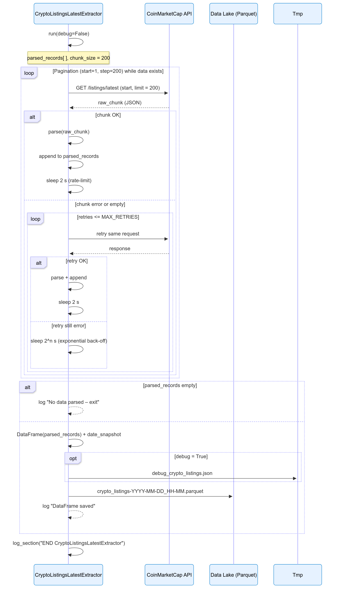
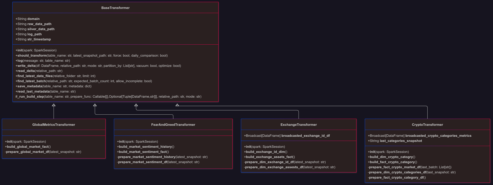
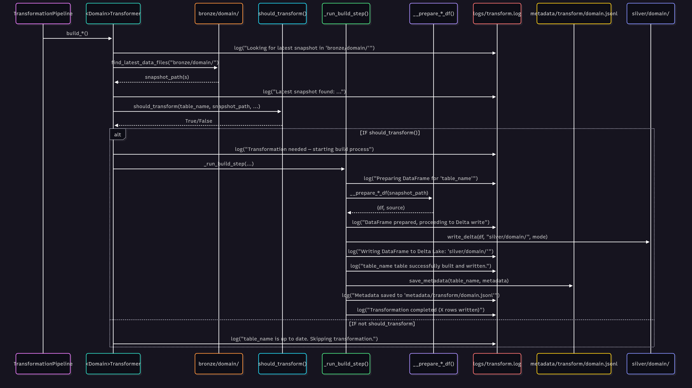
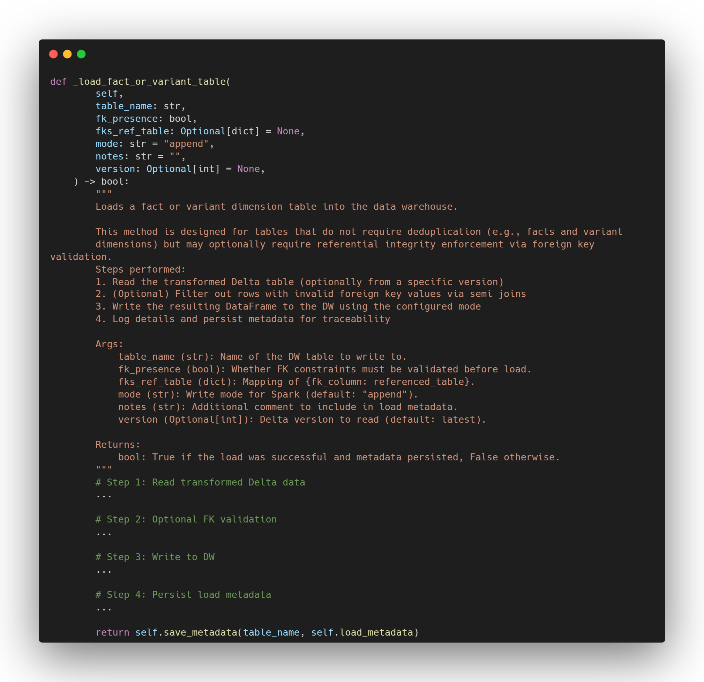
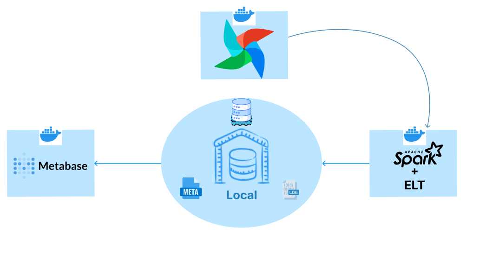
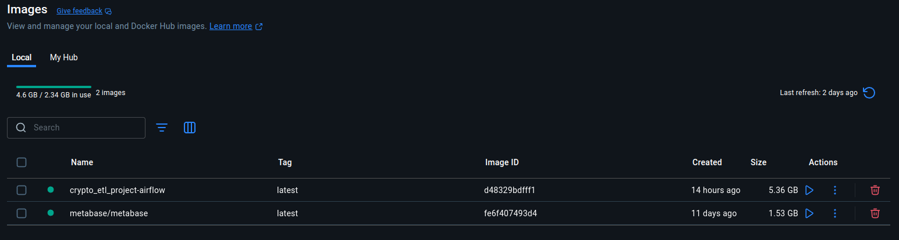
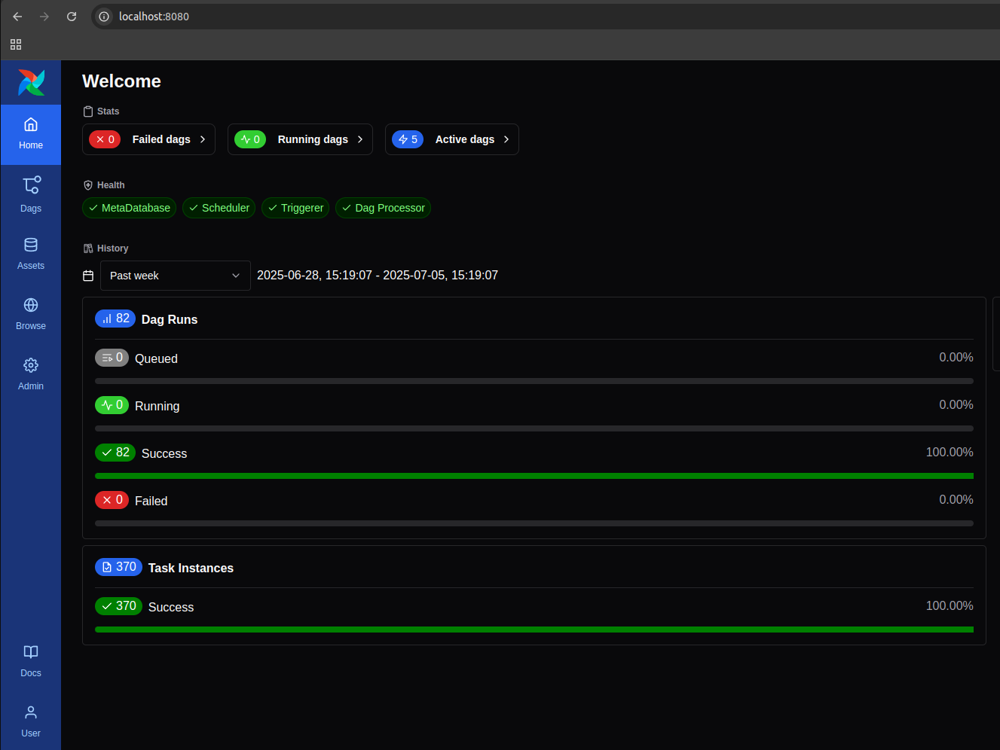
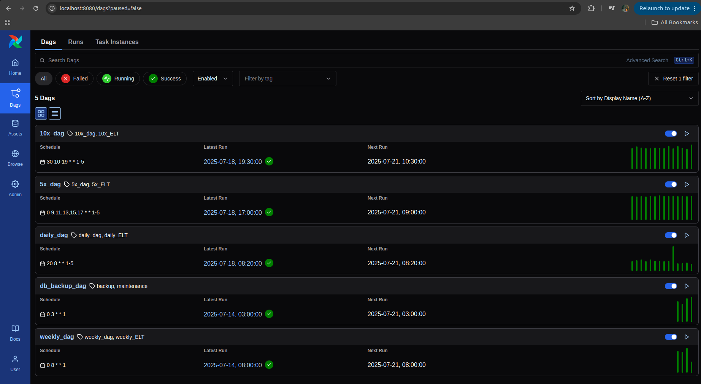
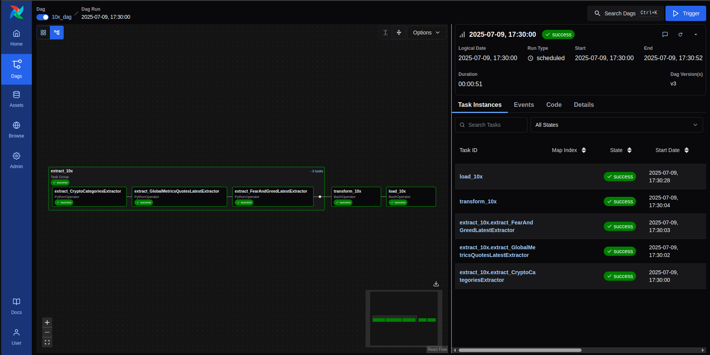
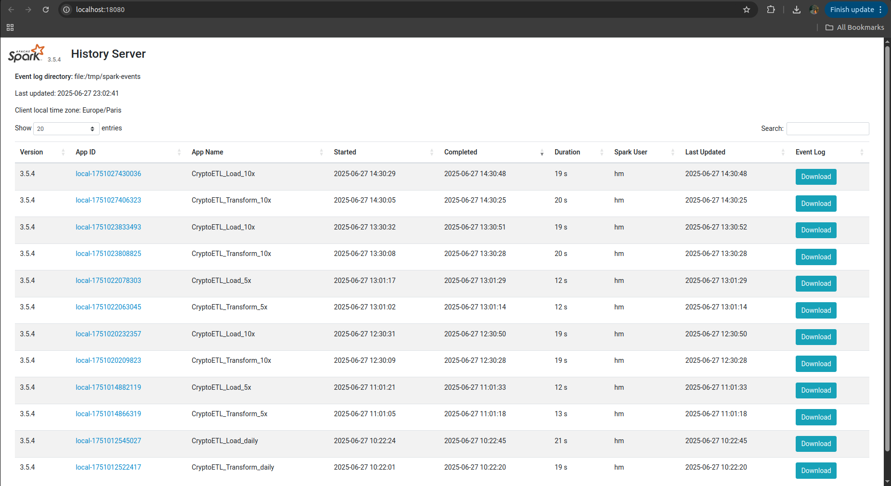

# CryptoAnalytics Platform

A French version 🇫🇷 of this documentation is available [here](READMOI.md)

## Summary

**CryptoAnalytics Platform** is a **hybrid Data Lake + Data Warehouse ELT pipeline** for **ingesting**, **transforming**, and **serving** cryptocurrency data using **Pandas**, **Apache Spark/Delta Lake**, PostgreSQL (**star/snowflake schema**), **Airflow** (orchestration), **Docker**, and **Metabase** (visualization).
Locally, raw data (JSON -> Parquet Bronze) is then transformed and enriched (Delta Lake - Silver) before being loaded into the relational DWH.

> Key deliverables (Airflow dashboards, Metabase visualizations, Spark UI monitoring) and each detailed step are accessible via the table of contents below.

---

## Table of Contents

1. [Introduction](#1-introduction)
2. [API Constraints & Architecture Decisions](#2-api-constraints--architecture-decisions)
3. [Global Platform Architecture](#3-global-platform-architecture)
4. [Data Lake Structure and Roles](#4-data-lake-structure-and-roles)
5. [Data Warehouse Architecture & Modeling](#5-data-warehouse-architecture--modeling)
6. [Extraction Layer](#6-extraction-layer)  _See 6.1–6.3 for details_
7. [Transformation Layer](#7-transformation-layer)  _See 7.1–7.6 for details_
8. [Load Layer](#8-load-layer)  _See 8.1–8.6 for details_
9. [Data Warehouse, SQL & Migrations - Structure & Roles](#9-data-warehouse-sql--migrations---structure--roles)
10. [Orchestration & Automation with Airflow](#10-orchestration--automation-with-airflow)
11. [Docker](#11-docker)
12. [Results Highlights + Optimizations](#12-results-highlights--optimizations)
13. [Skills Developed](#13-skills-developed)
14. [Possible Improvements & Future Enhancements](#14-possible-improvements--future-enhancements)

## Table of Figures

1. [Lakehouse Global Architecture](#3-global-platform-architecture)
2. [Data Lake Structure and Roles](#4-data-lake-structure-and-roles)
3. [Data Warehouse Domains](#diagrams-and-domain-examples)
4. [Sequential Schemas & Code Samples](#62-sequential-schemas--code-samples)
5. [UML Diagram - OOP Architecture of Transformers](#uml-diagram---oop-architecture-of-transformers)
6. [Execution Logic of the Spark & OOP Pipeline](#73-execution-logic-of-the-spark--oop-pipeline)
7. [OOP Architecture of the Load Layer](#oop-architecture-of-the-load-layer)
8. [Sequential Schema - Stable Dimension Loading](#sequential-diagram-of-a-stable-dimension-load)
9. [Focus on Refactored Methods](#focus-on-factorized-methods)
10. [Global Orchestration Diagram (Airflow)](#global-airflow-orchestration-diagram)
11. [Global Crypto Market KPIs Over Time](#a-global-crypto-market-kpis-over-time)
12. [BTC & ETH Dominance Trends](#b-btc--eth-dominance-trends)
13. [Top Categories by Market Cap / Dominance Index by Category](#c-top-categories-by-market-cap--dominance-index-by-category)
14. [Market Cap vs Fully Diluted Cap](#d-market-cap-vs-fully-diluted-cap)
15. [DeFi Sector Evolution](#e-evolution-of-the-defi-sector)
16. [Daily Trend of the Fear & Greed Index](#f-daily-trend-of-the-fear--greed-index)
17. [Airflow - Execution Monitoring (Weeks 1, 2, 3, 4 and Details)](#2-technical-observability---monitoring--orchestration)
18. [Spark UI - Job History and Real time Monitoring](#2-technical-observability---monitoring--orchestration)

---
## 1. Introduction

**CryptoAnalytics Platform** is a crypto-focused analytics platform built on a **hybrid ELT** architecture combining Data Lake and Data Warehouse.

- **Objective**: Capture, transform, and surface cryptocurrency data from public APIs for BI, decision-making, and data science.  
- **Ingestion**: Daily API extraction via **Pandas**, raw storage in **Parquet** (Bronze).  
- **Transformation**: Cleaning, enrichment, and KPI calculation in the **Silver Layer** (Delta Lake) using **Apache Spark**.  
- **Analytical Storage**: Analysis-ready data loaded via **Spark** into a **relational Data Warehouse** (star/snowflake schema).  
- **Visualization**: Dashboards via **Metabase**.  
- **Orchestration**: Pipeline managed by **Apache Airflow**, containerized with **Docker**, with logs, metadata, and quality views.  
- **Hybrid Architecture**: Only Silver uses Delta Lake; Gold serves as an **analytical archive**; BI logic lives in the DWH.

**Challenge**: Build a reliable daily history, transform raw data, compute business KPIs, and deliver a robust analytics architecture that unites **Data Lake** and **Data Warehouse** while ensuring **quality**, **traceability**, and **automation**.

---

## 2. API Constraints & Architecture Decisions

The pipeline is **designed to maximize the analytical value of crypto data while respecting the strict limits imposed by public APIs** (e.g. CoinMarketCap).

#### **Key Constraints**
- **Strict monthly quota (e.g. 10,000 credits/month):**  
  - Every API call “costs” credits, requiring **precise control of extraction frequency and volume**.
- **Endpoint variability:**  
  - Some endpoints are highly dynamic (price, market metrics: 5× or 10×/day), while others are stable (mappings, categories, info: daily/weekly).
- **No built-in history:**  
  - APIs only provide the current snapshot → the entire pipeline is built around **incremental archiving** (every snapshot is retained and timestamped to ensure historical analysis and reproducibility).
- **Weekday-only scheduling:**  
  - Runs occur Monday–Friday to **cut API costs without sacrificing business value** (markets move less on weekends; BI workflows are weekday-oriented).

#### **Core Architectural Decisions**
- **Frequency-based orchestration:**  
  - Refresh frequency is **driven by the data’s business dynamics**, not by domain.
    - **High-frequency fact tables** (market data, global metrics, sentiment…) run up to 10×/day for maximum freshness where it matters most.
    - **Stable reference tables** (dimensions) refresh daily or weekly, based on business criticality.
    - This split **optimizes freshness, performance, and cost**.
- **Fact-first strategy:**  
  - Prioritize freshness on fact tables (market, global metrics, sentiment) since they feed BI, reporting, and ML models.
- **Incremental extraction:**  
  - “Full scan” only during initialization; thereafter, only new or updated records are fetched to **drastically reduce API credit usage**.
- **Logging & auditability:**  
  - All extractions write structured logs and metadata files (including API stats) to guarantee transparency, replayability, and auditability.
- **Resilience:**  
  - Built-in retry/backoff/fallback for API errors, Airflow/crontab compatibility, and automated monitoring.
- **Strategic buffer:**  
  - Always maintain a **>35% credit buffer** to absorb spikes or failures.

#### **Tangible Benefits**
- **Maximum data freshness** for BI/ML without ever exceeding the API budget.  
- **Production-ready, fully traceable pipeline** that scales (paid tiers, new endpoints).  
- **Audit-first, fail-soft architecture:** no data is lost, and any failure can be recovered without technical debt.

> **In summary:**  
> The pipeline orchestrates **by data dynamics**, not by domain—ensuring freshness where it’s critical and restraint elsewhere.  
> This data-driven strategy delivers **performance, resilience, and cost control** at every step.

**Bottom line:**

> API constraints are not a blocker, but a **driver of innovation**: they guided the pipeline design, its smart frequency-based orchestration, systematic historization, and the robustness that define this platform.
>
> _These technical choices, dictated by API realities, ensure **industrialization**, **resilience**, and **scalability** ready for business scale-up._

---

## 3. Global Platform Architecture

The **CryptoAnalytics Platform** is built on a **hybrid Lake + Data Warehouse** approach. It combines:
- a **multi-layer Data Lake** (Bronze, Silver, Gold) for centralization, historization, distributed transformation, and as a **source for machine learning and data science**,  
- a **relational Data Warehouse** for analytical modeling, BI, and reporting.

The pipeline follows an **ELT** model, orchestrated by **Apache Airflow**, deployed in a **containerized** environment with **Docker**, and rigorously manages **metadata** (logs, quality, audit trails).


### **Pipeline stages:**
1. **Ingestion** (Pandas): automated API extraction into the **Bronze** layer (raw Parquet snapshots, timestamped by snapshot date).  
2. **Transformation & enrichment** (Apache Spark): process into the **Silver** layer (Delta Lake format, cleaned, enriched, BI/ML-ready).  
3. **Loading into the Data Warehouse**: Silver data is transformed, aggregated, and modeled (star/snowflake schema) in a relational analytical store.  
4. **Analytical backup**: DWH exports are archived in the **Gold** layer of the Data Lake (Delta) for backup and audit.

---

### **Key tools:**
- **Apache Airflow**: dynamic orchestration based on business-driven refresh frequencies  
- **Apache Spark**: distributed data transformation in Silver  
- **Pandas**: initial ingestion and Bronze layer preparation  
- **Docker**: containerization and pipeline reproducibility  
- **Metadata layer**: centralized logging, extraction stats, monitoring, and quality checks

---

This architecture ensures:
- **Incremental historization**: every snapshot is timestamped and stored in the appropriate layer  
- **Industrialized, modular pipeline**: fine-grained orchestration with clear ELT phase separation  
- **BI & data science–ready data**: cleaned and enriched in Silver, analytically modeled in the DWH  
- **Full traceability**: centralized logs, API metrics, and technical/business metadata  

---

## 4. Data Lake Structure and Roles


The **CryptoAnalytics Platform** Data Lake is organized into three functional layers:

- **Bronze**: raw storage of API‐extracted data in **Parquet** format for performance and Spark compatibility.  
  This layer ensures full **raw data retention** and **traceability**.

- **Silver**: cleaned, enriched, and transformed data via **Apache Spark**, stored in **Delta Lake** (ACID transactions, versioning, file optimization).  
  **Business KPIs are computed here**, making this an analytics‐ready layer for downstream consumption.

- **Gold**: serves as an **analytical archive**, containing **Data Warehouse exports** for **backup**, **audit**, and long‐term traceability.

Each layer serves a clear purpose:  
- **Bronze** = raw ingestion  
- **Silver** = data structuring & KPI calculation  
- **Gold** = analytical archiving  

Additionally, the Data Lake acts as a **centralized, versioned source for machine learning and data science workflows**, with strict metadata management at every stage (timestamps, logs, processing metrics).  

---

## 5. Data Warehouse Architecture & Modeling

**The CryptoAnalytics Platform Data Warehouse** is designed to be **modular**, **scalable**, and **analytics-driven**, enabling the centralization, historization, and cross-domain analysis of all critical data from the cryptocurrency ecosystem.

**Objective**: optimize both **business performance** (fast BI queries, advanced analytics) and **technical robustness** (governance, historization, scalability).

### Architecture Approach

- **Hybrid star and snowflake model**:

  - **Fact tables** follow a **star schema** (**denormalized** for **fast joins** and straightforward BI usage).
  - **Dimensions** are **modular** and **normalized** (**snowflake schema**): split into **stable entities** (`dim_id`), **enrichments** (`dim_info`), and **evolving** entities (`dim_map`) to maximize **maintainability** and **scalability**.

- **Systematic temporal historization**:
  The **`snapshot_timestamp`** column is present in **all tables** in the Data Warehouse.

  - **Fact tables** and **evolving tables (`dim_map`)**: operate as **pure append-only** (**time key**), each entry = **new snapshot**, **no data is ever overwritten** or modified.
  - **Static tables (stable dimensions)**: **append-only** management with **filtering logic**: Spark compares the **primary keys** already present in the Data Warehouse to the new ones; only **missing keys are added** (“append”), guaranteeing **integrity** and **non-duplication**.
    This mechanism ensures **complete historization**, **traceability of changes**, and **efficient management of static dimensions**.

- **Complex relationships managed**:

  - **Many-to-many relations** (e.g. cryptos ↔ categories) are modeled with dedicated **link tables** (`link_crypto_category`), allowing for advanced sectoral analyses.

- **Thoughtful normalization**:
  - Each dimension is split by **update frequency** (static, evolving), **data type** (identity, enrichment, variation), and **anticipated scalability**.
  - **Rarely modified dimensions** are separated from evolving dimensions, minimizing **I/O costs** and **redundancy**.
  - **No field is needlessly duplicated**: “volatile” data goes into **fact tables**, “static” data into **dimensions**, **enrichments** into **extensions**.

This structure enables **optimized storage costs**, **robust BI analytics**, and is ready for the integration of **advanced analytics** (sentiment analysis, ML predictions, macro and sectoral indicators).

### Diagrams and Domain Examples

Below are the UML diagrams for the Data Warehouse domains:

#### Exchange Domain


#### Crypto Market Domain


#### Categories Domain


#### Global Market Domain


#### Sentiment Domain


These diagrams illustrate:

- Central **fact tables** (measures, snapshots, etc.)
- Enriched and hierarchical **dimensions** (identity, info, map, categories)
- Complex links (e.g. N-N cryptos ↔ categories)
- An append-only organization for auditing, time series, and future predictions

### General Schema: Modular Star with Snowflake Components

| Aspect                      | Status | Comment                                                                                                                                  |
| --------------------------- | ------ | ---------------------------------------------------------------------------------------------------------------------------------------- |
| Star schema                 | Yes    | Fact tables (`fact_market_data`, `fact_exchange_assets`, etc.) point to clear dimensions (`dim_crypto_id`, `dim_exchange_id`, etc.)      |
| Modularity                  | Yes    | Each dimension is split into modules: identity, info, metrics, ensuring clarity and optimal maintainability                              |
| Partial snowflake           | Yes    | Normalized dimensions and link tables (e.g. `link_crypto_category`) reduce redundancy, factorize information, and handle N-N/hierarchies |
| Smart historization         | Yes    | `snapshot_timestamp` present everywhere                                                                                                  |
| Complex relations managed   | Yes    | N-N relations (crypto ↔ category), hierarchical links, business evolution                                                                |
| Scalability                 | Yes    | Model ready for tens of thousands of entities (crypto, exchange, categories, platforms, etc.)                                            |
| Rich analytical exploration | Yes    | Dashboards by coin, exchange, category, platform, sentiment, etc.                                                                        |

---

### Why a Hybrid (Star/Snowflake) Model?

This architectural choice combines the best of both worlds:

- **Analytical simplicity and speed for BI**: star schema for fact tables makes joins simple, queries fast, and the model easily usable by business analysts.
- **Robustness, scalability, and cost control**: partial snowflake normalization for some dimensions helps factorize information, avoid redundancy, separate responsibilities, and maintain the model even when adding new attributes or entities.
- **Business adaptability**: this flexibility makes it easy to adjust granularity or structure as needed for analysis or as the crypto ecosystem evolves.

**In summary:**  
The CryptoAnalytics Data Warehouse architecture combines:

- Ease of use and optimal analytical performance for BI,
- Guaranteed robustness, scalability, and flexibility,
- Full historization and traceability,
- Data governance and native openness to data science,  
  all while optimizing resources and maintainability for the project.

---

## 6. Extraction Layer

### 6.1 Data Extraction - Architecture, Design, and Implementation

The extraction phase is the **entry point of the ELT pipeline**.
Its role is to **collect, historize, and ensure the reliability** of data from multiple API endpoints, guaranteeing:

- **Full traceability** of every extraction (metadata, logs)
- **Quality and integrity** of stored data: error checks, validation, **automatic fallback mechanisms** in case of extraction failures
- **Systematic historization** (every snapshot is kept, timestamped, and never overwritten)
- **Modularity and scalability** (OOP architecture, new extractors easily added)

---

**1. Extraction Challenges & Constraints**

- **Multiple endpoints**: each endpoint (e.g., `/v1/cryptocurrency/listings/latest`, `/v1/global-metrics/quotes/latest`, etc.) has its own data formats, parameters, frequencies, and call limits.
- **API limitations**: handling throttling, lack of historical data, quota management, etc.
- **Historization & traceability**: every extraction snapshot must be kept for auditability, reproducibility, and to rebuild a reliable history.
- **Storage format**:
  - APIs return data in **JSON**.
  - **But for incremental daily historization**, storing each snapshot as JSON would be very costly in disk space and memory for large-scale analytics.
  - **Parquet format is preferred**: it compresses efficiently, enables fast selective reads, and integrates perfectly with Spark.

---

**2. Object-Oriented Extraction Architecture**

**Design Schema**

- **Parent class `BaseExtractor`**:

  - **Role**: Defines the shared functional base for all extractors, enforces a strict structure, and centralizes cross-cutting features.
  - **Responsibilities**:
    - Detailed logging (start, status, errors, metrics)
    - Reading/writing **metadata files** (JSON), specific to each extractor
    - API call handling (using `requests`, header management, retries…)
    - Writing data in optimized `.parquet` format, with timestamped filenames (`filename-YYYYMMDD_HHMMSS.parquet`)
    - Managing traceability (timestamp, snapshot, cross-references)
    - Requires implementation of `run()` (full extraction logic) and `parse()` (cleaning/structuring the API payload)
  - **Interface**:

    ```python
    from abc import ABC, abstractmethod

    class BaseExtractor(ABC):

        @abstractmethod
        def run(self):
            """Main extraction logic (must be implemented by subclasses)."""
            pass

        @abstractmethod
        def parse(self, data):
            """Specific parsing/cleaning logic (must be implemented by subclasses)."""
            pass

        # Other shared utilities: log(), save_metadata(), load_metadata(), save_parquet(), etc.
    ```

- **Specific extractors (`ExchangeExtractor`, `CryptoInfoExtractor`, etc.)**

  - **Role**: Each extractor inherits from `BaseExtractor` and **must implement** the `run()` and `parse()` methods.
  - **Extension**: Each extractor **can also add other methods** as needed for the endpoint (pagination, retry, business enrichment…).
  - **Class example**:
    ```python
    class CryptoInfoExtractor(BaseExtractor):
        def run(self):
            # Extraction logic for /v1/cryptocurrency/info
            ...
        def parse(self, raw_data):
            # Specific parsing for this endpoint
            ...
        # + additional methods as needed (e.g., retry management, formatting)
    ```

- **Traceability & historization**
  - Each extractor saves its `.parquet` files as:
    ```python
    filename_timestamped = f"{filename}-{self.timestamp_str}.parquet"
    ```
  - **Systematic historization and auditability**, no file is ever overwritten
  - Each extractor has its own **metadata file** containing:
    - Snapshot date
    - Source endpoint and parameters
    - Upstream/downstream snapshot refs (`extract_snapshot_ref`, `load_snapshot_ref`)
    - Extraction metrics (`num_loaded`, `num_to_fetch`, …)
    - Any status or errors

---

**3. Logging & Monitoring**

- **Each extractor** logs the entire process:
  - start of extraction
  - number of extracted rows, anomalies detected, API errors, delays
  - success or failure of each key step (API call, parsing, Parquet write, metadata save…)
- Logs are stored in a dedicated folder and can be used for monitoring or debugging (or via Airflow).

---

**4. Metadata Management & Reliability**

- **Unique metadata file per extractor**, JSONL format for appending, e.g.:
  ```jsonl
  {
    "snapshot_date": "2025-06-30 08:00:01",
    "total_count": 828,
    "source_endpoint": "/v1/exchange/info",
    "exchange_map_snapshot_ref": "2025-06-24 09:42:27"
  }
  ```
- This enables:
  - **Audit and traceability** of every execution
  - **Easy recovery** (in case of incident or failure)
  - **Quality control** (consistency in number of entities, tracking treated/skipped IDs…)

---

**5. Key Benefits of This Structure**

- **Industrialization** of extraction (robustness, logging, recovery on failure)
- **Extensibility**:
  - **adding a new endpoint** = create a new child extractor
  - **endpoint changes** = adapt the extractor class by adding/modifying methods
- **Traceability and governance** of data at every step
- **Automatic historization** (snapshot versioning, timestamped Parquet storage)
- **Optimized storage** (Parquet)
- **Separation of concerns**: each extractor is specific to its endpoint, shared code is factorized and tested.

---

### 6.2 Sequential Schemas & Code Samples

The extraction architecture relies on robust, industrial workflows-both traceable and optimized for big data.  
Here are three key examples illustrating the main patterns:

---

**1. Mapping Active Exchanges - `ExchangeMapExtractor`**

  
_Manages snapshots, diffs, and fallback for building the exchanges map (API usage optimization, auditability, change control)._

---

**2. Resilient Extraction of Assets by Exchange - `ExchangeAssetsExtractor`**

  
_Streaming, retry/backoff, and error tolerance for extracting assets per exchange, with automatic historization and run traceability._

---

**3. Real-time & Scalable Extraction of Crypto Listings - `CryptoListingsLatestExtractor`**

  
_Optimized pagination, chunk processing, and auto rate-limit management to capture reliable crypto market snapshots in real time._

---

**Key Code Snippets**

_Main `run()` method (extraction & storage orchestration, ExchangeAssetsExtractor)_


_Streaming method with `yield` (robust handling, ExchangeAssetsExtractor)_


---

**Example of Structured Extractor Log**


---

> _For full documentation of all workflows and extractors (10+ sequential diagrams), see [docs/diagrams/extractors/](/docs/diagrams/extractors/)._
>
> _For full logs, see [logs/extract.log](logs/extract.log)_

---

### 6.3 Best Practices & Data Engineering Highlights

The pipeline extraction layer was designed to **incorporate the best practices in data engineering**: robustness, scalability, auditability, and business optimization. Each extractor is engineered as a **production-ready component**, with a strong focus on **business value** and **technical performance**.

- **1. Scalability & “Big Data Ready” Performance**

  - **Chunk/stream processing (`yield`)**: supports thousands of extractions continuously without ever saturating RAM.

  - **Pagination & bulk extraction**: all extractors leverage API capabilities (pagination, limit=5000, 100-item batches) to minimize calls and speed up ingestion.

  - **Low memory footprint**: immediate parsing, controlled DataFrame construction, conditional storage.

- **2. Resource & API Cost Optimization**

  - **Diff/snapshot & change detection**: each extractor only processes what has actually changed (cryptos, exchanges, categories), avoiding unnecessary refetch or writes.

  - **Historical tracking for efficiency**: active IDs, whitelists, and “progressive enrichment” reduce quotas consumed while ensuring freshness.

  - **Anti-redundancy strategies**: no endpoint is called twice for the same data.

- **3. Resilience, Robustness & Error Tolerance**

  - **Retry management with exponential backoff**: all API calls are protected against network failures, timeouts, or quota limits, never blocking the global pipeline.

  - **Automatic fallback & self-healing**: in case of issues, extractors refresh their reference state autonomously.

  - **Non-blocking runs & error journaling**: every failed chunk/category is logged and gracefully skipped, process continues without crashing.

- **4. Traceability, Auditability & Governance**

  - **Detailed business & technical logs**: every run, every attempt, every correction is traced with context (ID, timestamp, results…).

  - **Systematic snapshot historization**: all Parquet/JSONL files are timestamped, making it easy to track, audit, and analyze for regression or troubleshooting.

  - **Auditability “by design”**: ability to replay, restore state at any date, or check extraction completeness.

- **5. Separation of Concerns & Design Patterns**

  - **Mother class/abstraction-oriented architecture**: each extractor inherits from `BaseExtractor` (logging, API handling, save/load metadata), ensuring code factorization and consistency.
  - **Single Responsibility Principle**: each extractor handles a single endpoint, enabling maintainability, testing, and fast extension to new data streams.
  - **Total modularity**: adding a new endpoint = new class, no refactor needed for other components.

---

**In summary:**

> The extraction layer of pipeline is not just functional: it **embodies the best of modern data engineering**, with real “business-ready” value, exemplary governance, and the ability to evolve and remain robust in a fast-moving and volatile crypto environment.

---

## 7. Transformation Layer

### 7.1 Spark Architecture & OOP - Overview

The transformation phase is the **analytical core of the pipeline**. Its purpose is to convert raw data from the Data Lake (the “bronze” layer) into enriched, structured, business-ready data (the “silver” layer), while ensuring quality, traceability, and large-scale performance.

---

#### **Objectives of the Transformation Phase**

Transformation is a key stage that involves:

- **Cleaning data**: removing duplicates, filtering anomalies, correcting formats and types.
- **Enriching and structuring**: joining datasets, calculating business indicators, normalization, aggregations.
- **Calculating KPIs and advanced indicators**: volatility, returns, trends, dominance, etc.
- **Preparing data for BI, reporting, and machine learning**: optimized formats (Parquet/Delta), strict typing, datasets usable by Spark, Metabase, PowerBI, or other analytics tools.

This stage ensures that the data produced is directly **consumable by end users** (analysts, data scientists, visualization tools) while maintaining historization, traceability, and data quality.

---

#### **Why Spark?**

**Apache Spark** was chosen for transformation for several reasons:

- **Big Data scalability and performance**: Spark enables processing of millions of rows in memory, in parallel, across a cluster, without sacrificing speed even on large data volumes.
- **Native compatibility with Parquet and Delta Lake**: Spark natively reads/writes these formats, optimizing I/O performance and facilitating industrialization.
- **Rich ecosystem**: Spark provides libraries for structured data manipulation (`DataFrame`), advanced ELT, machine learning, error management, and persistence.
- **Interoperability and orchestration**: Spark integrates seamlessly with Airflow (job scheduling), Docker (containerization), and allows reproducible execution on any infrastructure.
- **Ease of use for data engineering**: its Python API (PySpark) makes writing complex transformations readable and maintainable.
- **Advanced debugging and optimization**: Spark offers **powerful observability interfaces** (Spark UI, Spark History Server), enabling **debugging, optimization, and troubleshooting** for both real-time and historical jobs. This makes it easy to **track issues, analyze performance, resume jobs, and continuously improve the pipeline**.

---

#### **Single SparkContext & Frequency-based SparkSessions**

To maximize efficiency, robustness, and code readability:

- **A single SparkContext is created for the entire pipeline**: it centralizes Spark resource management and acts as the global coordinator.
- **Dedicated SparkSessions are instantiated for each processing frequency group** (for example: `daily`, `weekly`, `5x`, `10x`), rather than for each business domain.
  - **Each frequency group** may include one or more domains, depending on the criticality or data dynamics.
  - **This design is based on business importance and data volatility**:
    - **Fact tables**, which are highly dynamic and strategic for analysis or machine learning (market, volume, price, etc.), are refreshed frequently (e.g., `10x` or `5x` sessions).
    - **Static or enrichment tables** (mappings, reference data, metadata), which change less often, are processed in less frequent sessions (`weekly`, `daily`, etc.).

This organization allows:

- **Logical isolation of processing by frequency**, making monitoring, resource optimization, and business prioritization easier.
- **Adapting refresh frequency to data volatility and criticality**: maximizing freshness for analytics, reducing processing cost for stable data.
- **Advanced Spark config customization** for each type of run: memory tuning, parallelism, Delta Lake options…

---

#### **Smart Reading & Pipeline Resilience**

Thanks to advanced orchestration:

- **Each Spark transformation step reads only the latest files or batches generated** for each table, relying on metadata and timestamped naming conventions.
  - This means **only new snapshots or recent file groups** are processed at each run, systematically avoiding re-reading or reprocessing of already processed data.
  - The pipeline is thus **smart, resource-efficient, and optimized**: it never does the same work twice, and processing costs are controlled.
- This design also makes the pipeline **very robust and resilient**:
  - In case of incident, restart, or partial batch, Spark can simply resume from the last valid snapshot, without loss of history or integrity.
  - File traceability, via logs and metadata files, ensures the **ability to replay, audit, or correct any step**.
- **In case of omission, error, or incident on a transformation step**:
  - **All anomalies are systematically tracked** in metadata files dedicated to each table (per DataFrame) and in transformation logs.
  - **Human intervention** (data engineer) can then be requested to analyze, complete, or replay the affected transformation, safely.
  - **The pipeline remains operational**: it does not crash, does not block the chain, and continues to process other tasks or tables. Production and analysis are therefore never blocked.

---

#### **Integration with Airflow & Global Orchestration**

The **transformation phase** is fully orchestrated by **Apache Airflow**, ensuring:

- **Automated runs** at defined frequencies (daily, weekly, 10x, etc.)
- **Dependency management**: transformation only starts when required extractions are complete and valid.
- **Supervision, monitoring, and alerting**: Airflow centralizes logs, raises errors, and allows DAG (pipeline) tracking, offering perfect traceability for each step.
- **Interoperability and portability**: the pipeline can be triggered both locally and in production, thanks to Docker containerization and Airflow configurations.

---

#### **UML Diagram - OOP Architecture of Transformers**

The diagram below illustrates the object-oriented architecture:  
the parent class `BaseTransformer` centralizes all shared logic (logs, Spark, metadata, utility methods),  
while each business subclass (Crypto, Exchange, GlobalMetrics, etc.) implements domain-specific transformations.



_Each transformer inherits shared tools, ensuring modularity, robustness, and fast pipeline extension, with clear business separation._

**In summary**:

> The transformation phase relies on Spark for **performance and scalability**, OOP structuring for **maintainability and business scalability**, and Airflow orchestration for **automation, robustness, and production-ready governance**.
>
> This foundation enables to deliver reliable, BI/ML-ready, and evolutive data as the crypto market evolves, while ensuring **resilience, efficiency, and auditability**.

---

### 7.2 OOP Architecture - Code Structure

The transformation layer architecture is **fully object-oriented** and follows advanced software engineering principles (SOLID) to guarantee **modularity, clarity, maintainability, and scalability**.

```shell
transform/
├── base/
│   └── base_transformer.py      # Parent class, shared logging, Spark, metadata, shared logic
├── transformers/
│   ├── crypto_transformer.py    # Class for the Crypto domain
│   ├── exchange_transformer.py  # Class for the Exchange domain
│   └── ...                      # 1 file = 1 business domain = 1 class
├── orchestrators/
│   ├── transform_pipeline_runner.py  # Airflow entry point
│   └── transform_orchestrator.py     # Global orchestrator
├── runners/
│   ├── run_crypto_only.py       # Local/test run scripts
│   └── ...
```

**Explanations:**

- `base/`: contains the common foundations and shared utilities (including the `BaseTransformer` class).
- `transformers/`: contains all business transformers; **1 domain = 1 class = 1 file** (e.g., `CryptoTransformer`, `ExchangeTransformer`, etc.).
- `orchestrators/`: orchestrates the execution of all or a subset of transformations, typically managed by Airflow or scripts.
- `runners/`: scripts for running a local or partial transformation, useful for tests or manual debugging.

#### **Role of the Parent Class `BaseTransformer`**

The `BaseTransformer` class is the **common foundation** for all transformers; it goes beyond simple technical factorization:

- **SparkSession injection** (SparkSession is never created inside the transformers themselves, ensuring isolation and global control).
- **Shared features**:
  - structured logging,
  - centralized metadata management (snapshot, tracking, audit),
  - robust write methods for Delta/Parquet formats,
  - automatic optimization (`OPTIMIZE`, `VACUUM`).
- **Advanced utility methods**, including:

  - **`_run_build_step`**: executes the full logic of a transformation step for a given table, from preparation to writing and metadata update, including detailed logging.
  - **`should_transform`**: checks, via metadata, if the current snapshot has already been transformed, to avoid redundant processing and optimize runs.

- **Business flexibility**: the parent class **does not require a `run()` method implementation**, but provides all the tools to orchestrate each transformer (child class) according to business needs.

**Benefits:**

- Code factorization,
- Robustness and testability,
- Fast extension (adding a new domain = new inherited class),
- Smart and secure execution (no duplicate processing, centralized logs, complete auditability).

#### **“One Business Domain = One Class” Principle**

- **Each functional domain of the Data Warehouse** (Crypto, Exchange, Sentiment, Global Market, etc.) has its own transformer class, isolated in a dedicated file.
- **Each class**:
  - reads the snapshots for its respective domain,
  - **each DataFrame (table) managed in the class has its own metadata** (transformation tracking, status, history, etc.),
  - applies the business logic (cleaning, enrichment, joins, KPI calculation, etc.),
  - writes the final table (dim/fact) in Delta format,
  - manages logs and metadata via the parent class.
- **This structure simplifies onboarding, maintenance, and versioning**:
  - Modifying/extending one domain never impacts the others,
  - Each component can be tested, deployed, and monitored independently.

#### **Applying SOLID Principles**

- **SRP (Single Responsibility Principle)**: each transformer (child class) manages only a specific business domain, with a single clear responsibility.
- **OCP (Open/Closed Principle)**: the system is open to extension (adding a new domain/transformer) without needing to modify existing code.
- **DI (Dependency Injection)**: the SparkSession (and possibly other dependencies) is injected at runtime, never hardcoded in business classes, ensuring control and isolation.
- **DRY (Don’t Repeat Yourself)**: all shared logic (logs, audit, saving, optimization, etc.) is factored into the base class.

#### **Added Value of This Structure**

- **Readability and modularity**: the file structure reflects the business logic.
- **Scalability**: adding a new domain = one file, one class, zero refactoring elsewhere. Evolving an existing domain: simply **add or adapt a method** in its class, never impacting the rest of the pipeline.
- **Easier maintenance**: each transformer/test can be isolated, debugged, and monitored.
- **Production ready**: the orchestrator allows for global or partial pipeline runs, natural integration with Airflow, or manual execution.
- **Robustness and auditability**: logs, metadata, and history are always managed, and the shared tools in the parent class guarantee non-duplication, safety, and smart processing.

**In summary:**

> The OOP architecture adopted for the transformation layer enables **rapid evolution, robust governance, and optimized performance**, all while maintaining a clear structure tailored to the demands of a large-scale data project.

---

### 7.3 Execution Logic of the Spark & OOP Pipeline

The execution of the transformation pipeline relies on a **central orchestrator** (`TransformationPipelineRunner`) that manages the sequence of Spark processing tasks for each domain, according to the chosen frequency or mode (daily, weekly, 5x, 10x).

- **A single SparkSession instance is created per run**, adapted to the processing frequency (daily, weekly, etc.).
- **This SparkSession is injected into all business transformers via the orchestrator**.
- The orchestrator handles reading the latest snapshots, controls which transformations to perform (via metadata), orchestrates calls to business logic methods, ensures writing to Delta Lake, and updates logs/metadata.

#### **Sequential Diagram of a Transformation Execution**

The diagram below summarizes the flow of a transformation step:  
from detecting the snapshot to be transformed to writing to the silver layer, with management of logs and metadata.



Each step is tracked, optimized, and controlled to prevent any reprocessing or omissions, while ensuring auditability and recovery in case of incidents.

#### **Added Value**

> This architecture guarantees a **structured, modular, and robust execution**, where adding or modifying a transformer never impacts the rest of the pipeline.  
> The single injection of SparkSession, dynamic task sequencing, and centralization of logs/metadata ensure **performance, maintainability, and traceability** at project scale.

---

### 7.4 Detailed Example of a Business Transformer

To concretely illustrate the architecture, here is a simplified excerpt from the `CryptoTransformer` class, dedicated to the crypto-assets domain.

Each business transformer isolates the logic specific to its domain:

- it prepares DataFrames from the latest Data Lake snapshots (bronze),
- applies cleaning, enrichment, strict typing,
- and centralizes writing, traceability, and metadata updates via the inherited `_run_build_step` method.

Example:

```python
def build_fact_crypto_market(self, last_batch: List[str]):
    """
    Builds the fact_crypto_market table from the latest batch of market data.
    - Reads and cleans market snapshots,
    - Calculates business indicators (price, volume, etc.),
    - Logs each step and writes the table in Delta format,
    - Updates the associated metadata.
    """
    batch_paths = self.find_latest_batch("crypto_listings_latest_data")
    if not self.should_transform("fact_crypto_market", batch_paths[0], force=False, daily_comparison=False):

        self.log("fact_crypto_market is up to date. Skipping transformation.", table_name="fact_crypto_market")
        return

    return self._run_build_step(
        table_name="fact_crypto_market",
        prepare_func=lambda: self.prepare_fact_crypto_market_df(last_batch),
        relative_path="fact_crypto_market",
        mode="overwrite"
    )

def prepare_fact_crypto_market_df(self, last_batch: List[str]) -> Optional[Tuple[DataFrame, str]]:
    """
    Prepares the market DataFrame from the latest batch.
    - Reads Parquet files,
    - Filtering, cleaning, enrichment,
    - Calculates KPIs (volatility, average price…),
    - Logs the process,
    - Returns the cleaned DataFrame and the source path for traceability.
    """
    # 1. Read raw data
    # 2. Apply strict schema, clean fields, remove outliers
    # 3. Compute business indicators
    # 4. Log the operation, return (df, source_path)
    ...
    return df_cleaned, batch_path
```

This pattern is found in all business transformers:  
the business build logic is separated from the preparation/enrichment steps.

**Workflow factorization (writing, metadata, logs) is handled by the parent class.**  
**This ensures homogeneity, robustness, and rapid extension to any new domain.**

---

### 7.5 **Optimizations, Robustness & Scalability**

| Aspect                        | Technical Detail                                                                                                                          | Key Benefits                                                                             |
| ----------------------------- | ----------------------------------------------------------------------------------------------------------------------------------------- | ---------------------------------------------------------------------------------------- |
| **Optimization**              | Clean management of SparkSessions (one per frequency), minimized I/O (parquet, Delta, smart batching)                                     | Performance, controlled resource usage, lower costs, clarity in Spark UI for maintenance |
| **Robustness**                | Detailed logs (business & technical), Spark UI/History monitoring, systematic `.stop()` handling, errors captured and isolated, fail-soft | Traceability, easy recovery, never-blocking pipeline                                     |
| **Scalability**               | Adding modules or classes without refactoring, processing massive volumes                                                                 | Fast extension, adapts to growth                                                         |
| **Testability / readability** | Modular code, strict OOP, independently testable classes, clear structure, structured documentation                                       | Easier onboarding, straightforward maintenance, software quality                         |

---

### 7.6 **Highlights & Best Practices**

| Practice / Pattern              | Impact / Benefit                                                               |
| ------------------------------- | ------------------------------------------------------------------------------ |
| Adding a domain = new class     | Evolutionary model, zero technical debt, rapid business extension              |
| No massive refactor             | Robustness, stability, easy maintenance                                        |
| “Frequency-based” orchestration | Granular control, adapts to business needs, optimized performance              |
| Business-friendly logs          | Accessible business monitoring, easy tracking, full auditability               |
| Output data “BI/ML ready”       | Datasets ready for BI, reporting, and machine learning                         |
| Airflow, Delta, DWH compatible  | Easy integration into enterprise workflows, “out of the box” industrialization |

**Business Summary:**

> The OOP Spark architecture adopted here maximizes **maintainability, performance, and scalability** of the crypto pipeline, while ensuring robustness, auditability, and adaptability to all business needs (from raw data to advanced analytics).

---

## 8. Load Layer

### 8.1 Architecture & Overview - Load Layer

The **Load** phase is the final step that transfers “silver” data (transformed, enriched, analysis-ready) from the Data Lake to the **decision-making Data Warehouse** (PostgreSQL).  
Its aim is to make the data **exploitable, historized, and accessible** for BI and reporting, while ensuring robustness, integrity, and performance.

---

#### **Objectives of the Load Phase**

- **Integrate “silver” datasets into the Data Warehouse** for BI usage
- **Guarantee the quality and integrity** of loaded data (PK/FK checks, logs, auditability)
- **Enable historization and traceability** of load operations
- **Optimize performance**: batched loads, partitioning, monitoring
- **Industrialize and automate** the process via Airflow and a modular architecture

---

#### **Why Spark for the Load Phase?**

Even though the initial pipeline development was done locally, using Spark for loading into the Data Warehouse was chosen with the cloud and future scaling in mind:

- **Cloud-native scalability and performance**: Spark on a cluster can load massive volumes in parallel and perform read/write operations to PostgreSQL (or any cloud DWH) much faster than locally.
- **Accelerated validation and integrity management**: Key checks (PK/FK), filtering, and data processing leverage the cluster’s power instead of relying on local RAM/CPU.
- **Industrialization and multi-environment compatibility**: The same code runs locally for development/testing, and at scale on a Spark cluster in cloud production, with no need for rewriting.
- **Interoperability with the DWH**: Spark provides native connectors for PostgreSQL (and other cloud DWHs), enabling efficient, robust bulk and batch operations as well as transactional management.

> _This choice ensures a “future proof” pipeline, ready for the cloud and industrial-scale data processing-where a local script would quickly reach its limits in terms of volume and performance._

---

#### **Why a dedicated Load architecture?**

The choice of an OOP architecture for the Load phase is essential in order to:

- Factorize the management of SparkSession, logs, metadata, and integrity validation (PK/FK)
- Isolate the loading logic specific to each domain (Crypto, Exchange, etc.), making maintenance, scalability, and extension to new business needs easier
- Enable precise monitoring, granular incident recovery, and detailed audit of each load operation

---

#### **OOP Architecture of the Load Layer**

Each business loader (ExchangeLoader, CryptoLoader, etc.) inherits from a parent class `BaseLoader`, which provides:

- **Centralized management of SparkSession, logs, metadata**
- **Advanced integrity constraint management** (PK/FK)
- **Reading silver data ready to be loaded** (`read_delta`)
- **State validation and filtering on foreign keys** (`should_load`, `secure_fk_load`, `read_from_dw`)
- **Writing to the DWH** (`write_to_dw`), centralizing load logic (`_load_fact_or_variant_table`, `_load_stable_dim_table`)

> _See diagram below_


_Each business loader inherits the factorized logic from `BaseLoader`:  
readiness checks, integrity control, logs, and fine-grained metadata management.  
This model ensures maximum robustness, rapid extension to any new domain, and easier pipeline maintenance._

---

### 8.2 OOP Architecture - Code Structure

The **Load** layer architecture is fully object-oriented and relies on advanced software engineering principles (SOLID) to guarantee **modularity, clarity, maintainability, and scalability**.

```shell
load/
├── base/
│   └── base_loader.py             # Common parent class, logging, Spark management,
|                                    FK/PK control, metadata management, shared logic
├── loaders/
│   ├── crypto_loader.py           # Class dedicated to the Crypto domain
│   ├── exchange_loader.py         # Class dedicated to the Exchange domain
│   └── ...                        # 1 file = 1 business domain = 1 class
├── orchestrators/
│   │   load_pipeline_runner.py    # Airflow entry point
│   └── load_orchestrator.py       # Global orchestrator (LoadPipelineRunner)
└── runners/
    ├── run_crypto_load.py         # Local execution scripts
    └── ...
```

**Explanation:**

- **`base/`**: contains common foundations and shared utilities (including the `BaseLoader` class):
  - SparkSession management,
  - Structured logging,
  - Centralized metadata management (read/write),
  - Integrity checks (FK/PK validation),
  - Utility methods (`read_delta`, `read_from_dw`, `write_to_dw`, `should_load`, `secure_fk_load`, etc.).
- **`loaders/`**: groups all business loaders; **1 domain = 1 class = 1 file** (e.g., `CryptoLoader`, `ExchangeLoader`…).
  - Each loader implements domain-specific methods (fact table loading, dimensions, link tables…) while inheriting all the factorized logic.
- **`orchestrators/`**: orchestrates the execution of all or a subset of loads, typically managed by Airflow.
- **`runners/`**: scripts to run a local or partial load, useful for testing or manual debugging.

#### **Role of the `BaseLoader` Parent Class**

The `BaseLoader` class is the **common foundation** for all business loaders;  
it goes beyond simple technical factorization:

- **SparkSession injection** (never directly created inside loaders).
- **Shared features**:
  - Structured logging,
  - Centralized and fine-grained metadata management (reading transformation metadata, load tracking, audit),
  - Robust methods for reading (`read_delta`), FK/PK validation (`secure_fk_load`, `read_from_dw`), and writing (`write_to_dw`).
- **Advanced utility methods**, including:
  - **`should_load`**: checks via metadata whether the data is ready to be loaded or already loaded,
  - **`_load_fact_or_variant_table()`**: centralizes append-only loading logic (tables with a temporal primary key),
  - **`_load_stable_dim_table()`**: only loads new records to a stable dimension (with composite or simple PK detection, and optional FK validation).
- **Business flexibility**: the parent class **does not require a `run()` method implementation**, but provides all the tools needed to orchestrate each loader as required by business needs.

---

**Benefits:**

- **Code factorization** (no more redundancy),
- **Robustness and testability** (each loader/test is isolated, integrated monitoring),
- **Rapid extension** (adding a domain = new inherited class),
- **Intelligent and secure execution** (FK filtering, logs, traceability, zero double-loading, full auditability).

---

#### **“1 Business Domain = 1 Class” Principle**

- **Each functional DWH domain** (Crypto, Exchange, Sentiment, Global Market…) has its own loader class, isolated in a dedicated file.
- **Each class:**
  - reads the silver datasets to load,
  - **each DataFrame (table) managed within the class has its own metadata** (transformation tracking, statuses, histories, etc.),
  - checks readiness (transformation metadata),
  - validates PK/FK by reading the existing DWH,
  - applies domain-specific business logic (append loading, integrity validation, etc.),
  - writes to the Data Warehouse,
  - manages logs and metadata via the parent class.
- **This structure makes onboarding, maintenance, and versioning easier:**
  - Modifying/extending a domain never impacts the others,
  - Each component can be tested, deployed, and monitored independently.

---

#### **Application of SOLID Principles**

- **SRP (Single Responsibility Principle)**: each loader only manages one specific business domain, a single clear responsibility.
- **OCP (Open/Closed Principle)**: the system is open to extension (adding a domain/loader) without having to modify existing code.
- **DI (Dependency Injection)**: SparkSession (and possibly other dependencies) are injected at runtime, never hardcoded inside business classes, guaranteeing control and isolation.
- **DRY (Don’t Repeat Yourself)**: all shared logic (logs, audit, controls, FK/PK handling, writing, etc.) is factorized in the base class.

---

#### **Added Value of This Structure**

- **Readability and modularity**: the folder structure reflects the business logic.
- **Scalability**: adding a new domain = one file, one class, zero refactor for the rest. **Evolving a domain = add or adapt a method**, without impacting the global pipeline.
- **Easier maintenance**: each loader/test can be isolated, debugged, and monitored.
- **Production ready**: the orchestrator allows piloting all or part of the pipeline (full/partial), natural integration with Airflow or manual execution.
- **Robustness and auditability**: logs, metadata, and history are always managed; the parent class’s shared tools guarantee no duplicate loads, security, and business compliance.

---

**In summary:**

> The OOP architecture adopted for the Load layer ensures **pipeline industrialization, rapid scalability, robust governance, and maximum business traceability**,  
> while remaining clear, modular, and perfectly suited for the requirements of an enterprise data project.

---

### 8.3 Execution Logic of the Load Pipeline & OOP

The execution of the load pipeline relies on a **central orchestrator** (`LoadPipelineRunner`) that manages the sequence of Spark loaders for each business domain, according to the defined logic and frequency (daily, weekly, 5x, 10x, etc.).

- **A single SparkSession is injected into all business loaders**, ensuring isolation, performance, and global control of the pipeline.

- The orchestrator manages reading the latest “silver” data, checks readiness via metadata, orchestrates integrity checks (PK/FK), triggers the business loading logic, ensures writing to the Data Warehouse, and updates logs/metadata.

---

#### **Sequential Diagram of a Stable Dimension Load**

The diagram below summarizes the flow of a load step:  
from checking prerequisites to writing into the Data Warehouse,  
including deduplication, key validation, and management of logs and metadata.


_Each step is traced, optimized, and controlled to prevent any double-loading or omissions,  
while ensuring auditability, recovery, and robustness throughout the value chain._

---

> **Note:**  
> By default, loaders **read the most recent version of each Delta table** (thanks to Spark-Delta), ensuring the highest data freshness.
>
> In case of incidents, the pipeline is **designed to explicitly target a previous version of the Delta table**: history navigation is native, allowing for **granular rollback, full audit**, or incident recovery.
>
> **Manual intervention** may be required to correct or replay a problematic load,  
> but the pipeline remains **resilient and “fail-soft”**: it continues to load other tables, never blocking the entire analytics chain.

---

#### **Added Value**

> This architecture guarantees a **structured, modular, and robust execution**, where each business loader can be tested, monitored, replayed, or adapted independently of the rest of the pipeline.  
> The unique SparkSession injection, dynamic task sequencing, centralization of logs/metadata, and business integrity checks ensure **performance, reliability, and traceability** at project scale.

---

### 8.4 **Business Pattern: Loading a Fact Table**

The Load layer applies a factorized pattern for all fact or variant tables:  
**systematic readiness checks**, “append-only” loading mode (temporal primary key), native Delta history management, and full traceability.

#### **Business Example: `load_fact_global_market`**

Each business loader has a dedicated public method for each fact table, orchestrating the entire process:

```python
def load_fact_global_market(self, version: int = None) -> None:
    """
    Loads the fact_global_market table from the Delta silver layer into the data warehouse.

    This method assumes that the specified Delta version corresponds to a fully transformed
    snapshot that has not yet been loaded into the warehouse.

    Important:
    The version being loaded must not contain snapshot_timestamp values
    already present in the data warehouse, due to a primary key constraint.
    """
    table = "fact_global_market"
    self.log_section(title=f"Loading Started for {table}")

    if not self.should_load(table):
        self.log_section(title=f"Loading Skipped for {table}")
        return

    status = self._load_fact_or_variant_table(
        table_name=table,
        fk_presence=False,
        version=version,
        mode="append",
        notes="Load from transformed global metrics delta table",
    )

    if status:
        self.log(f"Loaded operation for {table} succeeded", table_name=table)
    else:
        self.log(f"[ERROR] Load failed or incomplete for {table}", table_name=table)

    self.log_section(title=f"Loading Ended for {table}")
```

> **This method orchestrates the business workflow**:  
>  structured logs, idempotence check via `should_load`, call to the factorized logic `_load_fact_or_variant_table`, comprehensive reporting and audit.

#### **Focus on Factorized Methods**

The core robustness of the pipeline is built on these shared methods:

- **`should_load`**: ensures that loading only occurs if a new, valid snapshot is available (idempotence).
- **`_load_fact_or_variant_table`**: applies all “append-only” logic, Delta version management, optional FK validation, writing to the DWH, and logging.

**Code snapshot:**




> **These methods ensure:**
>
> - **Idempotence** (never double-load, never any data loss)
> - **Full auditability** (logs, metadata)
> - **Native support for Delta versioning** (history navigation, rollback, debug)
> - **Scalability** (factorized pattern for all fact or variant tables)

**Summary:**

> Integrating these patterns into all business loaders guarantees performance, robustness, and scalability,  
> making every load flow fully traceable, testable, and production-ready.

---

### 8.5 **Optimizations, Robustness & Scalability**

| Aspect                   | Technical Detail                                                                                                                                                         | Key Benefits                                         |
| ------------------------ | ------------------------------------------------------------------------------------------------------------------------------------------------------------------------ | ---------------------------------------------------- |
| **Optimization**         | “Live” Delta reads + historical navigation, batched loads, optimized PK/FK validation, controlled I/O (bulk write), parameterizable Spark/Postgres mode                  | High performance, controlled I/O, reduced costs      |
| **Robustness**           | Detailed logs, fine-grained Airflow and business log tracking, `.stop()` handling, isolated error catching, idempotence (`should_load`), Delta versioning, easy rollback | Never-blocking pipeline, traceability, easy recovery |
| **Scalability**          | Add domains/loaders without refactoring, multi-table, multi-batch, cloud/Spark cluster ready, “full” or “partial” mode                                                   | Fast extension, adapts to growth                     |
| **Auditability/quality** | Centralized metadata (per table), transformation-to-load mapping, rollback/versioning support, detailed business logs                                                    | Quality control, process validation, full audit      |

---

### 8.6 **Highlights & Best Practices**

| Practice / Pattern                    | Impact / Advantage                                                          |
| ------------------------------------- | --------------------------------------------------------------------------- |
| “should_load” pattern                 | Zero duplication, safety, total idempotence                                 |
| `_load_fact_or_variant_table` pattern | Robustness, factorization, scalability, reusable for all facts/variants     |
| Integrated Airflow orchestration      | Monitoring, centralized logs, retry, fine dependency management             |
| Out-of-the-box Delta version support  | Rollback, debug, historical navigation, resilience, easy human intervention |
| Adding a domain = 1 file/class        | Evolutionary model, rapid business extension, no technical debt             |
| Automated PK/FK control               | Quality, auditability, referential integrity                                |
| Business-friendly logs                | Process tracking, full audit, accessible monitoring                         |
| “DWH-ready” output data               | Data ready for BI, reporting, and data science                              |

**Business summary:**

> The modular, factorized Load architecture enables rapid scaling, total traceability, and “production-ready” business governance.  
> The business patterns (should_load, append only, Delta navigation…) ensure the robustness, scalability, and resilience of the crypto pipeline, from raw data to decision support.

---

## 9. Data Warehouse, SQL & Migrations - Structure & Roles

The project is organized to ensure a strict separation between:

- the ELT code (Python/Spark),
- the Data Warehouse logic (SQL, governance, BI),
- the automation of schema management and migrations.

Here’s how the technical layers are structured on the DWH side:

---

### **warehouse/** - _Data Warehouse SQL & BI Layer_

- **Mission**:  
   Centralizes all SQL logic, administration scripts, quality governance, business analytics views, and monitoring for the PostgreSQL DWH.
- **Key Content**:
  - `admin/`: automated initialization scripts, security, role and permission management (.env driven)
  - `scripts/`:
    - DCL/: role/schema creation
    - procedures/: quality, data cleaning, automated enrichment
    - tests/: manual quality test suites (by domain)
    - views/: anomaly views, business (KPI), monitoring (freshness, latency, NULLs)
- **Why?**  
   To isolate business and BI logic from Python code, industrialize data quality, and facilitate SQL monitoring and collaboration.
- [See detailed README](warehouse/README.md)

---

### **src/db/** - _DWH Schema Management & Utilities (SQLAlchemy + backup)_

- **Mission**:  
   All Python logic for **versioned** and **automated** PostgreSQL schema management (ORM SQLAlchemy, Alembic migrations, backup scripts).
- **Key Content**:
  - `models.py`: DWH schema declaration in SQLAlchemy (single source of truth for Alembic)
  - `backup_postgres.py`: complete backup/restore utility, scriptable via Airflow
- **Why?**  
   To ensure versioning, integrity control, and automation of structural changes-without manually editing SQL.  
   _All modifications go through here before hitting production._
- [See detailed README](src/db/README.md)

---

### **alembic/** - _Versioned Schema Migration Management_

- **Mission**:  
   Centralizes the full history of PostgreSQL DWH schema changes (via Alembic): migration scripts, upgrades/downgrades, collaborative versioning.
- **Key Content**:

  - `env.py`: Alembic configuration (links .env + SQLAlchemy)
  - `versions/`: all migration scripts, auto-generated or custom
  - Full migration history and basic commands (upgrade, downgrade, autogenerate…)

- **Why?**  
   To ensure traceability, reproducibility, collaboration, and easy rollback across the DWH infrastructure.
- [See detailed README](alembic/README.md)

---

> **In summary:**
>
> - Each layer (SQL, ORM, migration, tests, BI, monitoring) is isolated in its own dedicated folder, documented, and maintainable.
> - The local documentation in each folder is **sufficient and up-to-date**: just link to it from the main doc.
>
> - This organization **guarantees professional governance, easier onboarding, and full end-to-end industrialization**.

---

## 10. Orchestration & Automation with Airflow

### 10.1 **Orchestration Architecture - Airflow Global Overview**

The **Airflow** platform orchestrates **the entire ELT pipeline**, from automated data extraction to post-load quality checks. This orchestration ensures:

- **Full automation** of the data lifecycle,
- **Modularity and intelligent orchestration**:  
  the pipeline is modular by business domain (each component handles a specific scope),  
  and Airflow orchestrates execution in “frequency-based blocks” using runner scripts (`transform_pipeline_runner.py`, `load_pipeline_runner.py`), triggering all required modules for each run based on the frequency.
- **Monitoring**, **traceability**, and **incident recovery**.

#### **Global Airflow Orchestration Diagram**

The architecture of the main pipeline DAGs is illustrated below:


#### **Diagram Explanation**

1. **EXTRACT TaskGroup - PythonOperator**

   - **Role:** launches data extraction (API) by calling the `run()` method of each business extractor (one per endpoint, e.g., `/v1/cryptocurrency/listings/latest`).
   - **Task serialization:** each extraction is encapsulated in a _TaskGroup_, with tasks sequenced to respect quotas/limitations of public APIs.
   - **Frequency-based automation:** DAGs trigger extractions according to the defined frequency (daily, weekly, 5x, 10x, etc.).

2. **TRANSFORM Task - BashOperator (Spark)**

   - **Role:** triggers the Spark job via `spark-submit` to execute the transformation phase in distributed batch mode.
   - **Cloud-ready automation:** the task runs the runner script (`transform_pipeline_runner.py`), passing the business frequency as an argument (e.g., daily, weekly, 5x, 10x, etc.). This frequency targets only relevant transformations.
   - **Delta Lake storage:** all transformed data is written to the _silver_ layer of the Data Lake, in Delta format, ready for the next phase.
   - **Logic:**  
      This “frequency-based” system provides flexible and efficient orchestration:
     - A single Python script (`transform_pipeline_runner.py`) manages all frequencies, creating a dedicated SparkSession per run (with explicit naming for monitoring).
     - The frequency argument dynamically orchestrates the required processing (`run_daily_tasks`, `run_weekly_tasks`, etc.), factoring business logic for maximum robustness.
     - This pattern favors scalability, observability (Spark UI), and pipeline industrialization, both locally and on cloud/distributed environments.

3. **LOAD Task - BashOperator (Spark + Postgres JARs)**

   - **Role:** triggers the Spark job for the “Load” phase via the runner script (`load_pipeline_runner.py`), passing the business frequency as an argument.
   - **Native connection to the Data Warehouse:** with Postgres drivers (`.jars`), Spark writes directly to the Data Warehouse (PostgreSQL) in batch mode, managing integrity constraints (PK/FK) and partitioning as needed.
   - **Delta reading and validation:** Spark reads the latest version of the Delta _silver_ tables (or a specific version for rollback), deduplicates, validates keys, and only inserts new compliant records.
   - **Logic:**
     - The Python script `load_pipeline_runner.py` centralizes all load logic for each frequency.
     - A dedicated SparkSession is created per run (named by frequency, e.g., `CryptoETL_Load_<frequency>`), making monitoring easier.
     - Based on the frequency (`daily`, `weekly`, `5x`, `10x`, `all`), the appropriate method is called (`run_daily_tasks()`, etc.), dynamically orchestrating the loads of all necessary tables.
     - The integration of Postgres drivers enables transactional, compliant, and efficient loading.
     - The process ensures idempotence (metadata, integrity), traceability, and the ability to rollback or selectively rerun in case of incident.

4. **POST-LOAD/SQL TaskGroup - SQLExecuteQueryOperator**

   - **Role:** after each load, runs SQL procedures to guarantee data quality, fill certain NULL fields, etc.
   - **Quality control:** these post-load tasks are grouped and managed independently, allowing modularity and targeted reruns if needed.
   - **Example:** `CALL fill_nulls_spot_volume_and_wallet_weight();`

---

#### **Key Features of Airflow Orchestration**

- **Frequency-based control:** each DAG manages all tables/domains for a given frequency (e.g., “DAG daily”, “DAG weekly”, etc.).
- **Modular execution:** possibility to replay an isolated step (extract only, transform only, etc.).
- **Integrated monitoring and alerting** (Airflow UI, logs, notifications).
- **Complementary DAGs:**
  - **Init DAG:** performs the initial full load of the Data Warehouse, extracting all data. This DAG is triggered manually from the Airflow UI; it initializes the DWH to allow for incremental frequency-based operation afterward.
  - **Backup DAG:** complete DWH (Postgres) backup with dedicated scheduling.
- **Robustness & recovery:** in case of incident, the modularity of tasks enables granular recovery and full traceability.

---

### 10.2 **Operational Summary**

> **Airflow orchestrates the entire ELT pipeline**, ensuring industrialization, governance, and scalability ready for production.
>
> The combination of TaskGroups, specialized operators, and frequency/domain partitioning enables:
>
> - enforcement of API constraints,
> - maximization of Spark performance on large volumes,
> - and guaranteed business quality and data traceability at every step.

---

**Note:**  
Thanks to this design, adding a new domain, a new frequency, or a new quality check can be simply integrated by extending the script logic or adding a TaskGroup/task to the Airflow DAG, without ever breaking existing functionality.

**In summary:**

> The Airflow architecture of this project enables robust, configurable, and extensible orchestration, naturally adapting to evolving business needs and production technical constraints.
>
> **This architecture and design are reproducible in any cloud or on-premises environment, thanks to containerization (Docker) and configuration management via Airflow.**

---

## 11. Docker

### Target Architecture



The initial goal was to provide a fully dockerized stack:

- Airflow, Spark/ELT, and Metabase each running in separate containers
- A local Data Warehouse, shared with containers through Docker volumes for logs and metadata
- All services communicating over the Docker network

---

### Why is the Data Warehouse (DWH) not dockerized?

The central database is **intentionally not dockerized** to mirror real-world, production-grade architectures, where:

- The DWH is a stable, external cloud service (e.g., Snowflake, Google BigQuery, Amazon Redshift, etc.)
- The data must be persistent and independent from the lifecycle of any container

**Locally, the DWH remains on the host machine**, ensuring stability and persistence,  
and simulating the behavior of an actual cloud-based solution.

---

### Dockerization Limitations Encountered

Despite extensive testing, several significant limitations emerged:

- **Architectural Complexity**

  - Difficult communication between Airflow and Spark when separated into multiple containers (file/script sharing, port management, DWH/logs accessibility)
  - Complex handling of shared volumes and data synchronization

- **Airflow Instability in Docker**

  - Frequent scheduler and webserver crashes
  - UI bugs, connection drops

- **Attempting Airflow + Spark in a single container**

  - Very large image size (>5.3 GB, see below)
  - Ongoing Airflow instability (crashes, slowdowns)

- **Dependency and Performance Issues**
  - Challenging to manage Java, Python, Spark, and Airflow dependencies in a single image
  - Very long build/startup times

---

### Image Size Example



---

### Final Choice: Hybrid & Pragmatic Stack

**To guarantee stability, simplicity, and portability:**

- **Airflow and Spark/ELT are installed locally** (outside of Docker) for better performance and easier maintenance
- **Docker Compose is used for lightweight services** (Metabase, and optionally the DB for testing)
- `/logs`, `/metadata`, and `/data` folders are shared locally for data and log persistence

---

### Conclusion

> This approach documents the technical journey,  
> explains the rationale and limitations encountered,  
> and aligns with current industry best practices.

---

## 12. Results Highlights + Optimizations

**This section showcases the business value and operational robustness, from advanced analytical dashboards to technical monitoring tools.**

### **1. Business Value - Data Visualizations (Metabase)**

Each visualization below is powered in real-time by the Data Warehouse.  
The data is historized, updated, and can be dynamically explored/filtered by any analyst.

---

#### **A. Global Crypto Market KPIs Over Time**

**Question:** _How are the main indicators of the crypto market evolving (total market cap, volume, liquidity), and what major events have influenced these trends?_

**Represented indicators and associated axes:**

- **Total Market Cap**

  Total crypto market capitalization (left axis, in USD)  
   Measures the overall value of all cryptocurrencies at any given time.

- **Total Volume 24h**

  Total traded volume over 24 hours (left axis, in USD)  
   Indicates market activity and periods of high or low liquidity.

- **Total Volume 24h Reported**

  “Reported” volume over 24 hours (left axis, in USD)  
   Allows comparison between actual and reported volumes to detect anomalies or potential manipulation.

- **Market Liquidity Ratio**

  Market liquidity ratio (right axis, unitless or as a %)  
   Assesses the ease of trading on the market: a high ratio indicates a liquid market, while a low ratio signals tight liquidity.


_Overview: time evolution of the main KPIs of the global crypto market.  
(Users can click on the legend to isolate a specific indicator according to their analysis needs.)_

---

#### **B. BTC & ETH Dominance Trends**

**Question:** _How has the combined market share of Bitcoin and Ethereum evolved? What tipping points can be observed?_

**Represented indicators and associated axes:**

- **BTC Dominance / ETH Dominance**  
  Percentage of the total crypto market capitalization held by Bitcoin and Ethereum, respectively.  
  _Left axis (%)._  
  Enables tracking the weight of each leader in the overall market.

- **BTC Dominance Delta / ETH Dominance Delta**  
  Difference between the current and previous day's dominance for Bitcoin and Ethereum (24-hour change).  
  _Right axis (delta in percentage points)._  
  Highlights rapid moves or trend breaks from day to day, useful for detecting market shifts or shocks.


_Legend:_ This visualization combines “stable” dominance (level) and “dynamic” dominance (variation) to analyze both the stability of market shares and periods of rapid shifts in crypto leadership.

---

#### **C. Top Categories by Market Cap / Dominance Index by Category**

**Question:** _How do the dominance and liquidity of the Ethereum ecosystem (or any other category) evolve over time?_

**Represented indicators and associated axes:**

- **Dominance per Token**  
  Total market capitalization amount (USD) attributed to this category at any given time  
  _Left axis (USD)._  
  Tracks the “market power” of the selected category (here: Ethereum Ecosystem).

- **Volume to Market Cap Ratio**  
  Ratio of 24-hour trading volume to the total market capitalization of the category  
  _Right axis (unitless ratio, generally between 0 and 1)._  
  Indicates the liquidity of the category: a high ratio signals intense activity, while a low ratio indicates low turnover.


_Legend:_ Example shown for Ethereum, but dynamic visualization available for more than 280 categories.

---

#### **D. Market Cap vs Fully Diluted Cap**

**Question:** _How do actual market cap, fully diluted cap, and dominance evolve over time?_

**Represented indicators and associated axes:**

- **Market Cap USD**  
  Actual market capitalization (total value of all tokens currently in circulation).  
  _Left axis (USD)._  
  Tracks the effective market valuation at a given time.

- **Fully Diluted Market Cap USD**  
  Potential market capitalization if all scheduled tokens were already issued.  
  _Left axis (USD)._  
  Puts into perspective the “maximum” possible valuation of the project/market.

- **Market Cap Dominance USD**  
  Percentage represented by the studied capitalization (project, sector, etc.) relative to the entire crypto market.  
  _Right axis (%)._  
  Measures the relative importance of this segment within the overall ecosystem.


_Legend:_ Comparison between actual valuation and maximum potential valuation.

_Note:_ “Market Cap” = value of tokens in circulation; “Fully Diluted” = if all tokens were issued.

---

#### **E. Evolution of the DeFi Sector**

**Question:** _What is the dynamic (size, activity, market share) of the DeFi sector over time?_

**Represented indicators and associated axes:**

- **DeFi Market Cap**  
  Total market capitalization of the DeFi sector, in USD.  
  _Left axis._  
  Tracks the overall size and evolution of decentralized finance.

- **DeFi Volume 24h**  
  Total 24-hour trading volume for the DeFi sector, in USD.  
  _Left axis._  
  Indicates the intensity of activity and daily liquidity in the sector.

- **DeFi Volume Share**  
  Share of DeFi volume compared to total crypto volume (in %).  
  _Right axis._  
  Measures the relative importance of the DeFi sector among all crypto trading.


_Legend:_ Joint evolution of market cap, daily volume, and DeFi market share over time.

---

#### **F. Daily Trend of the Fear & Greed Index**

**Question:** _What recent periods of extreme sentiment (fear/greed) have been observed in the crypto market? How do these cycles overlap with major price movements?_

**Represented indicator:**

- **Crypto Fear & Greed Index**  
  Aggregated index (from 0 to 100) summarizing the overall sentiment of the crypto market, based on several signals: volatility, volume, trends, social networks, etc.
  - **Extreme Fear (0-24):** strong pessimism, panic.
  - **Fear (25-49):** negative sentiment.
  - **Neutral (50):** balance.
  - **Greed (51-74):** optimism, risk appetite.
  - **Extreme Greed (75-100):** euphoria, potential overheating.


_Legend:_ Daily fluctuations of the “Fear & Greed” index, useful for anticipating risks and opportunities.

---

### **2. Technical Observability - Monitoring & Orchestration**

The screenshots below illustrate the **orchestration, monitoring, and robustness** of the platform, through:

- **Airflow (Monitoring & Orchestration)**

  - Real-time monitoring of DAG status: number of runs, successes, failures, active tasks, etc.
  - Detailed execution history over the week, allowing audits of pipeline stability and availability.
  - Clear visualization of each phase of the ETL workflow, from extraction to post-load, facilitating debugging and maintenance.

    - `Airflow: Monitoring of executions during the first week in production`  
        
       _All executed DAGs achieved 100% success (**no failures, 0% failed**). The interface details all runs and tasks, attesting to the pipeline’s **reliability and stability** from the very start of production._
    - `Airflow: Monitoring of executions during the second week in production`  
        
       _The pipeline’s stability is confirmed: **100%** of executed DAGs and tasks were completed with no failures (**0% failed**). This weekly monitoring ensures production-grade **availability and robustness**._
    - `Airflow : Monitoring executions during the third week in production`  
        
       _The pipeline maintains its stability over time: **100%** of executed DAGs and tasks were successful, with zero failures (**0% failed**). This third weekly monitoring confirms the ongoing **reliability** and operational excellence of the production workflow._
    - `Airflow: Monitoring of Executions During the Fourth Week in Production`  
        
       _The pipeline’s stability is confirmed once again over the past week: **100%** of DAGs and tasks executed were completed successfully (**0% failed**, no incidents recorded). This fourth weekly monitoring highlights the **robustness** and **operational maturity** of Airflow orchestration in production._
    - `Airflow : Overview of active and scheduled DAGs`  
        
       _This interface displays the complete list of active DAGs in Airflow, showing for each the status of the latest runs, the next scheduled run, and a graphical history of executions (green bars = success).
      It provides a synthetic and immediate view of the overall health of orchestration, schedule compliance, and the **absence of failures across all critical tasks** (daily, 5x, 10x, backup, weekly, etc.)._
    - `Airflow: Detailed execution of the daily DAG (daily_dag) on 07/09/2025`  
        
       _All pipeline steps were completed **successfully** (success). The detailed view ensures traceability and quick verification of each workflow phase._
    - `Airflow: Detailed execution of the 10x_dag (07/09/2025)`  
        
       _Detailed status of the 10x_dag execution on 07/09/2025: every workflow step (extract, transform, load) completed successfully, ensuring pipeline reliability._

- **Spark UI (Scalability Monitoring)**

  - Real-time visualization of all Spark jobs and associated tasks (success, failed, running).
  - Immediate identification of tasks that succeeded, failed, or took longer than expected, with comparison of execution times versus expectations (real vs expected performance monitoring).
  - Detailed analysis of durations for each pipeline stage (transform, load, etc.) to optimize bottlenecks.
  - Complete traceability of processing for each data batch, with accessible logs and execution history.

    - `Spark UI - History Server: Detailed job history`  
         
       _This interface presents the full history of Spark jobs executed by the pipeline, including their name, start/end date and time, duration, and associated user.
      It enables tracing all processing performed during the period, accessing execution logs for each job, and auditing the pipeline’s stability or performance over time._
    - `Spark UI – Jobs: Real-time monitoring of pipeline execution`  
         
       _Spark UI dashboard displaying all pipeline jobs in real-time. Instantly shows the status (success, running, failed) and duration of each job, enabling immediate supervision and quick diagnosis of any slowdowns._

---

### **3. Business & Technical Impact - Summary**

- **Proven stability & reliability:**  
  Over more than a month of production execution, **no failures have been observed** across all DAGs and tasks (0% failed).  
  The Airflow and Spark UI screenshots below show a 100% success rate, demonstrating the pipeline’s robustness, orchestration quality, and the reliability of extraction, transformation, and loading scripts.

- **End-to-end automation:**  
  All pipeline phases are fully automated, from data collection to data exposure. Data is historized, updated, and accessible with no manual intervention.

- **Self-service analytics & Metabase flexibility:**  
  Analysts have access to a Metabase platform directly connected to the Data Warehouse:

  - Creation and customization of dynamic dashboards (filters, drilldown, time range selection…)
  - Ability to perform **advanced SQL queries** directly from the interface, with no IT dependency
  - Export of results in multiple formats (CSV, JSON, interactive charts…)
  - Easy sharing of visualizations or reports with stakeholders
  - Real-time interactivity with updated data (ad hoc analysis or continuous monitoring)

- **Scalability & technical robustness:**  
  The architecture, based on Spark, Airflow, and Delta Lake, ensures fast processing, easy monitoring, efficient resource management, and operational resilience.

- **Data governance & quality:**  
  Traceability, auditability, and quality controls are ensured at every stage, guaranteeing KPI reliability and compliance with production-grade requirements.

---

**In conclusion:**

> _The CryptoAnalytics platform thus delivers real business value, ready for production use, with strong governance, advanced observability, and rapid extensibility._
>
> _The Airflow, Spark UI, and Metabase dashboards below demonstrate smooth operation, operational monitoring, and easy data exploration._

---

## 13. Skills Developed

This project enabled me to strengthen a range of key skills across technical, methodological, and organizational domains.

### Technical Skills

- **Data Engineering:**
  - Data Warehouse modeling (star & snowflake schemas)  
  - Data historization, versioning, and governance  
  - End-to-end ELT project structuring

- **Big Data & Distributed Processing:**
  - Designing and developing batch Spark pipelines (PySpark)  
  - Cloud-ready architecture (spark-submit, dynamic frequency, modularity) for deployment on Spark clusters  
  - Monitoring with Spark UI

- **Orchestration & Automation:**
  - Full pipeline orchestration with Apache Airflow  
  - Dynamic DAG structuring by business frequency (daily, weekly, etc.)  
  - Integrating Spark, SQL, Shell, and Python tasks into a robust automated workflow

- **Databases & Advanced SQL:**
  - PostgreSQL optimization, analytical views, stored procedures  
  - Quality testing, governance, and monitoring via SQL scripts

- **Infrastructure & Deployment:**
  - Docker & Docker Compose  
  - Metabase for business-driven visualization  
  - Schema migrations with Alembic & SQLAlchemy  
  - Shell scripts for automating PostgreSQL initialization (roles, schemas, permissions)

### Methodological Skills

- Structuring a data project from A to Z  
- Professional technical documentation (README, architecture diagrams, logs)  
- Version control (Git) and reproducibility

### Cross-Functional Skills

- Rigorous data governance and quality assurance  
- Investigating and resolving complex bugs (Airflow, Spark, Docker)  
- Communicating results through clear, pedagogical dashboards  
- Autonomy, time management, and DevOps mindset (automation, resilience, logging)

---

**In summary**  
This project gave me a comprehensive view of the data lifecycle in a production environment—from raw ingestion to business analytics—while tackling architecture, governance, and scalability challenges.

---

## 14. Possible Improvements & Future Enhancements

- **Cloud deployment & auto-scaling**  
  Migrate the infrastructure to a public cloud (AWS, GCP...) to benefit from auto-scaling and high availability.

- **Advanced monitoring & alerting**  
  Integrate solutions such as Prometheus for real-time monitoring, alert management, and proactive incident detection.

- **Data quality & extended observability**  
  Implement automated data quality tests (SodaSQL) to strengthen business trust and governance.

- **Multi-pipeline orchestration**  
  Extend Airflow to orchestrate multiple or chained pipelines, integrating additional sources (on-chain, social networks, etc.).

- **Advanced Machine Learning**  
  Leverage Data Lake datasets (optimized and ML-friendly) to deploy predictive or scoring models, with automated retraining.

- **CI/CD integration for schema migrations**  
  Add a dedicated Airflow DAG to automatically apply Alembic migrations to the Data Warehouse, enabling robust and traceable CI/CD for data pipelines.
