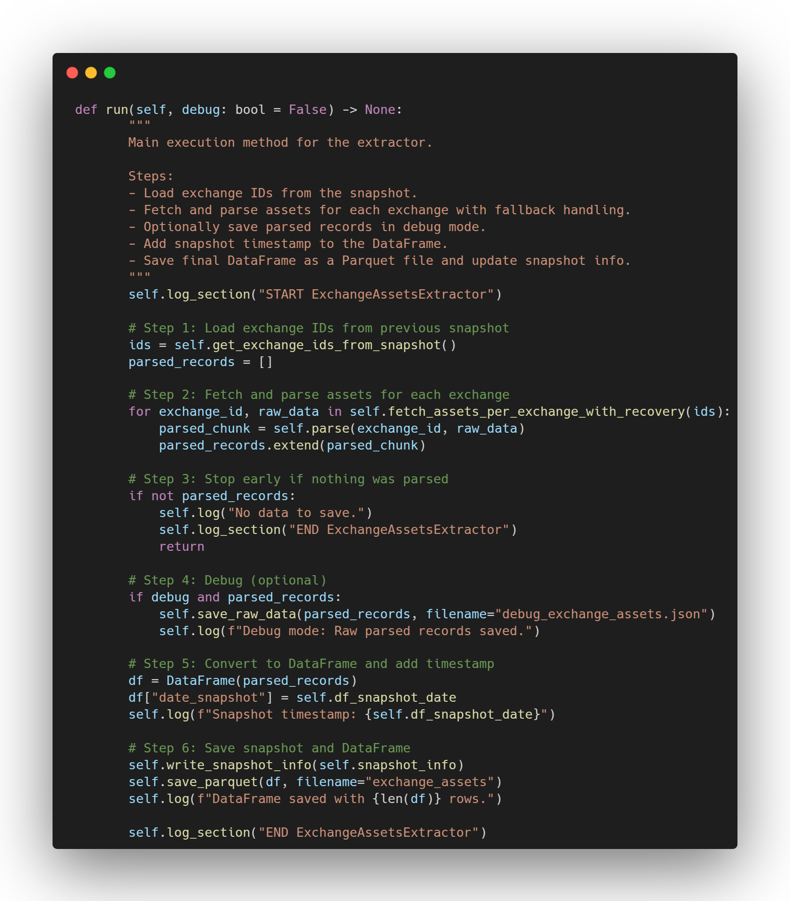
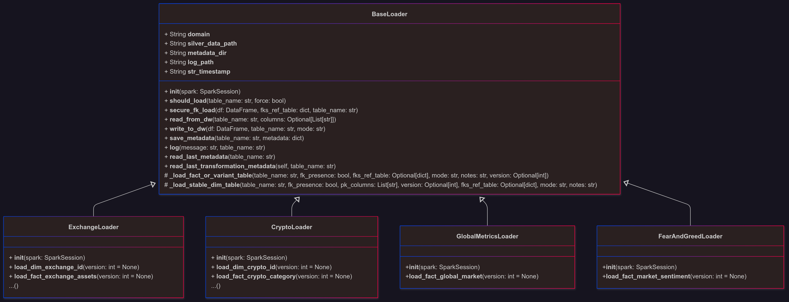
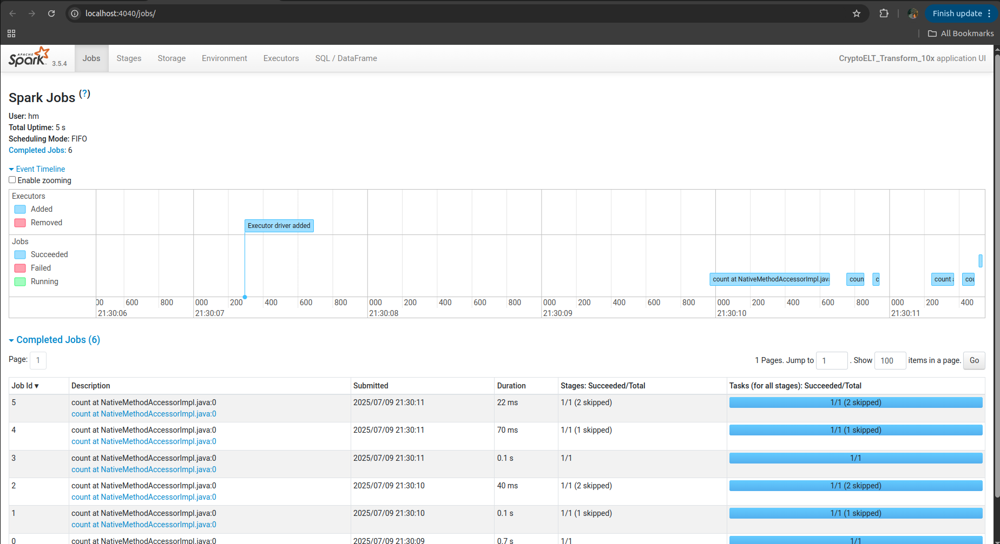

# CryptoAnalytics Platform

## Résumé

**CryptoAnalytics Platform** est un **pipeline ELT hybride Data Lake + Data Warehouse** pour **ingérer**, **transformer** et **servir** des données de cryptomonnaies en s’appuyant sur **Pandas**, **Apache Spark/Delta Lake**, PostgreSQL (**modèle étoile/flocon**), **Airflow** (orchestration), **Docker** et **Metabase** (visualisation).  
En local, les données brutes (JSON -> Parquet Bronze) sont ensuite transformées et enrichies (Delta Lake - Silver), avant d’être chargées dans le DWH relationnel.

> Les principaux résultats (dashboards Airflow, visualisations Metabase, monitoring Spark UI) et chaque étape détaillée sont accessibles via la table des matières ci-dessous.
---

## Table des matières

1. [Introduction & pitch du projet](#1-introduction)
2. [Contraintes API & Décisions d’Architecture](#2-contraintes-api--décisions-darchitecture)
3. [Architecture globale de la plateforme](#3-architecture-globale-de-la-plateforme)
4. [Structure et rôle du Data Lake](#4-structure-et-rôle-du-data-lake)
5. [Architecture et modélisation du Data Warehouse](#5-architecture-et-modélisation-du-data-warehouse)
6. [Extraction layer](#6-extraction-layer)  _Voir 6.1–6.3 pour plus de détails_
7. [Transformation layer](#7-transformation-layer)  _Voir 7.1–7.6 pour plus de détails_
8. [Load layer](#8-load-layer)  _Voir 8.1–8.6 pour plus de détails_
9. [Data Warehouse, SQL & Migrations - Structure et Rôles](#9-data-warehouse-sql--migrations---structure-et-rôles)
10. [Orchestration & Automatisation avec Airflow](#10-orchestration--automatisation-avec-airflow)
11. [Docker](#11-docker)
12. [Highlights sur les résultats + optimisations](#12-highlights-sur-les-résultats--optimisations)
13. [Compétences développées](#13-compétences-développées)
14. [Améliorations possibles & perspectives](#14-améliorations-possibles--perspectives)

## Table des figures

1. [Architecture globale du Lakehouse](#3-architecture-globale-de-la-plateforme) 
2. [Structure du Data Lake](#4-structure-et-rôle-du-data-lake)
3. [Domaines du Data Warehouse](#diagrammes-et-exemples-de-domaines)
4. [Diagrammes séquentiels & extraits de code - Extraction data engineering](#62-schémas-séquentiels--extraits-de-code---extraction-data-engineering)
5. [Diagramme UML - Architecture POO des Transformers](#diagramme-uml---architecture-poo-des-transformers)
6. [Logique d’exécution du pipeline Spark & POO](#73-logique-dexécution-du-pipeline-spark--poo)
7. [Architecture POO de la couche Load](#architecture-poo-de-la-couche-load)
8. [Schéma séquentiel d’un chargement de dimension stable](#schéma-séquentiel-dun-chargement-de-dimension-stable)
9. [Zoom sur les méthodes factorisées](#zoom-sur-les-méthodes-factorisées)
10. [Schéma global d’orchestration Airflow](#schéma-global-dorchestration-airflow)
11. [KPIs globaux du marché crypto dans le temps](#a-kpis-globaux-du-marché-crypto-dans-le-temps)
12. [Tendance de dominance BTC & ETH](#b-tendance-de-dominance-btc--eth)
13. [Top catégories par market cap / Indice de dominance par catégorie](#c-top-catégories-par-market-cap--indice-de-dominance-par-catégorie)
14. [Market Cap vs Fully Diluted Cap](#d-market-cap-vs-fully-diluted-cap)
15. [Évolution du secteur DeFi](#e-Évolution-du-secteur-defi)
16. [Tendance quotidienne de l’indice Fear & Greed](#f-tendance-quotidienne-de-lindice-fear--greed)
17. [Airflow - Suivi des exécutions semaine 1, 2, 3, 4 et détails](#2-observabilité-technique---monitoring--orchestration)
18. [Spark UI - Historique et jobs en temps réel](#2-observabilité-technique---monitoring--orchestration)

---
## 1. Introduction

**CryptoAnalytics Platform** est une plateforme analytique orientée cryptomonnaies, basée sur une architecture **ELT hybride** combinant Data Lake et Data Warehouse.

- **Objectif** : historiser, transformer et valoriser des données crypto issues d’API publiques pour la BI, la prise de décision et la data science.
- **Ingestion** : extraction quotidienne via API (Pandas), stockage brut au format **Parquet** (Bronze).
- **Transformation** : nettoyage, enrichissement et calcul de KPI métiers dans la **Silver Layer** (Delta Lake) à l’aide de **Apache Spark**.
- **Stockage analytique** : les données prêtes à l’analyse sont chargées via **Spark** dans un **Data Warehouse relationnel** (modèle étoile/flocon).
- **Visualisation** : tableaux de bord via **Metabase**.
- **Orchestration** : pipeline supervisé par **Apache Airflow**, conteneurisé avec **Docker**, avec gestion des logs, métadonnées et vues de qualité.
- **Architecture hybride** : seule la Silver utilise Delta Lake ; la Gold sert d’**archive analytique** ; la logique BI repose sur le DWH.

**Challenge** : construire un historique quotidien fiable, transformer la donnée brute, calculer des KPI métiers et exposer une architecture analytique robuste combinant **Data Lake** et **Data Warehouse**, tout en assurant **qualité**, **traçabilité** et **automatisation** des traitements.

---

## 2. Contraintes API & Décisions d’Architecture

Le pipeline est **conçu pour maximiser la valeur analytique des données crypto tout en respectant les contraintes strictes imposées par les APIs publiques** (CoinMarketCap).

#### **Contraintes majeures**
- **Quota mensuel strict (ex: 10 000 crédits/mois)** :  
    - Chaque appel d’API est “payant”, ce qui impose un **pilotage précis de la fréquence et de la volumétrie des extractions**.
- **Variabilité des endpoints** :  
    - Certains endpoints sont très dynamiques (prix, marchés, métriques : 5x ou 10x/jour), d’autres sont stables (mappings, catégories, info : daily/weekly).
- **Absence d’historique** :  
    - Les APIs ne donnent accès qu’à l’instantané courant → **toute la logique du pipeline est orientée “archivage incrémental”** (chaque snapshot est conservé et horodaté pour garantir l’analyse historique et la reproductibilité).
- **Weekday-only scheduling** :  
    - La collecte se concentre sur les jours ouvrés (Monday-Friday) pour **réduire le coût API sans sacrifier la valeur business** (marché presque stable le weekend, workflows BI orientés semaine).

#### **Décisions structurantes dans le pipeline**
- **Orchestration “frequency-based”** :
    - La fréquence de rafraîchissement n’est **pas définie par domaine**, mais par la **nature et la dynamique métier** de chaque jeu de données.
        * **Les tables de faits les plus dynamiques** (marché, global metrics, sentiment…) sont orchestrées à haute fréquence (jusqu’à 10x/jour), pour garantir une fraîcheur maximale là où l’impact analytique est le plus fort.
        * **Les dimensions stables** et référentiels, moins volatiles, sont rafraîchis quotidiennement ou hebdomadairement, selon leur criticité métier.
        * Ce découpage permet d’**optimiser à la fois la fraîcheur, la performance et le coût de traitement.**
- **Stratégie “fact-first”** :  
    - La priorité de fraîcheur est donnée aux tables de faits (marché, global metrics, sentiment), qui alimentent directement la BI, le reporting et les futurs modèles de data science.
- **Extraction incrémentale** :
    - “Full scan” uniquement lors de l’initialisation,
    - Ensuite, seules les nouvelles ou les données mises à jour sont extraites (incrémental), ce qui réduit drastiquement le coût en crédits API.
- **Logs et auditabilité** :  
    - Toutes les extractions sont **tracées dans des fichiers de métadonnées et des logs structurés** (avec stats API) pour garantir la transparence, l’analyse et la capacité de rejouer ou d’auditer chaque run.
- **Robustesse** :  
    - Gestion native des erreurs API (retry, backoff exponentiel, fallback), compatibilité avec Airflow/crons, et monitoring automatique.
- **Buffer stratégique** :  
    - La stratégie garantit toujours une **marge de crédits (>35%)** pour absorber toute hausse de charge ou incident.

#### **Bénéfices concrets**

- **Maximisation de la fraîcheur des données clés** pour la BI/ML sans jamais dépasser le budget API.
- **Pipeline “production-ready”**, traçable, prêt à scaler (paid API tier, nouveaux endpoints…).
- **Architecture orientée auditabilité** et “fail-soft” : aucune extraction n’est perdue, tout incident est rattrapable sans dette technique.

 **En résumé :**
>
>Le pipeline n’orchestre **pas “par domaine”**, mais **selon la dynamique réelle des données**, garantissant fraîcheur là où c’est critique et sobriété ailleurs.
Cette stratégie data-driven assure à la fois **performance, robustesse, et maîtrise des coûts** à chaque étape.

**En synthèse :**  
> Les contraintes API ne sont pas un frein, mais un **moteur d’innovation** : elles ont guidé le design du pipeline, son orchestration intelligente par fréquence, l’historisation systématique, et la robustesse qui caractérisent cette platform.
>
>_Ces choix techniques, dictés par la réalité des APIs, assurent une **industrialisation**, une **résilience** et une **évolutivité** prêtes pour le scale-up métier._

--- 

## 3. Architecture globale de la plateforme

L’architecture de **CryptoAnalytics Platform** s’appuie sur une approche **hybride Lake + Data Warehouse**.  
Elle combine :
- un **Data Lake multi-couches** (Bronze, Silver, Gold) pour la centralisation, l’historisation, la transformation distribuée, et comme **source pour le machine learning et la data science**,
- un **Data Warehouse relationnel** pour la modélisation analytique, la BI et le reporting.

Le pipeline suit un modèle **ELT**, orchestré par **Apache Airflow**, exécuté en environnement **Dockerisé**, avec une gestion rigoureuse des **métadonnées** (logs, qualité, traçabilité).


### **Étapes du pipeline :**
1. **Ingestion** (Pandas) : extraction automatisée via API vers la couche **Bronze** (stockage brut en Parquet, historisé par date de snapshot).
2. **Transformation & enrichissement** (Apache Spark) : passage en **Silver** (format Delta Lake, données nettoyées, enrichies, prêtes pour la BI/ML).
3. **Chargement dans le Data Warehouse** : les données Silver sont transformées, agrégées et modélisées (étoile/flocon) dans un entrepôt relationnel dédié à l’analyse.
4. **Backup analytique** : les exports du DWH sont historisés dans la couche **Gold** du Data Lake (Delta), à des fins d’archivage et de traçabilité.

---

### **Outils clés :**
- **Apache Airflow** : orchestration dynamique selon la fréquence métier des datasets
- **Apache Spark** : transformation distribuée des données en Silver
- **Pandas** : ingestion initiale et préparation de la couche Bronze
- **Docker** : conteneurisation et reproductibilité du pipeline
- **Metadata layer** : gestion des logs, stats d’extraction, monitoring et qualité

---

**Cette architecture assure :**
- **Historisation incrémentale** : chaque snapshot est horodaté et stocké dans les couches appropriées
- **Pipeline industrialisé et modulaire** : orchestration fine, découplage complet des phases ELT
- **Données prêtes pour la BI et la data science** : nettoyage et enrichissement réalisés en Silver, structure analytique dans le DWH
- **Traçabilité complète** : logs, statistiques API, metadata techniques et métiers centralisés

---

## 4. Structure et rôle du Data Lake


Le Data Lake de **CryptoAnalytics Platform** est structuré en trois couches fonctionnelles :

- **Bronze** : stockage brut des données extraites des APIs, au format **Parquet**, pour des raisons de performance et de compatibilité avec Spark.  
  Cette couche assure l’**historisation complète** et la **traçabilité** des données sources.

- **Silver** : données nettoyées, enrichies et transformées via **Apache Spark**, stockées au format **Delta Lake** (ACID, versioning, optimisation des fichiers).  
  Les **KPI métiers y sont également calculés**, ce qui en fait une couche analytique prête à être chargée dans le Data Warehouse.

- **Gold** : utilisée comme **zone d’archivage analytique**, contenant des **exports du Data Warehouse** à des fins de **backup, traçabilité et audit**.

Chaque couche répond à un objectif précis :  
- **Bronze** = conservation brute  
- **Silver** = structuration et calcul métier  
- **Gold** = archivage analytique  
Le tout est supervisé par une gestion rigoureuse des **métadonnées** à chaque étape (horodatage, logs, stats de traitement).

----

## 5. Architecture et modélisation du Data Warehouse

**Le Data Warehouse de CryptoAnalytics Platform** a été conçu pour être **modulaire**, **scalable** et **orienté analytique**, afin de centraliser, historiser et croiser l’ensemble des données critiques issues de l’écosystème crypto.

**Objectif** : optimiser à la fois la **performance métier** (requêtes BI rapides, analyses avancées) et la **robustesse technique** (gouvernance, historisation, évolutivité).

### Approche d’architecture

- **Modèle hybride étoile et flocon** :
    - **Les tables de faits** suivent un **schéma étoile** (**dénormalisé**, pour des **jointures rapides** et une exploitation **BI simple**).
    - **Les dimensions** sont **modulaires** et **normalisées** (**schéma flocon**) : séparées en **entités stables** (`dim_id`), **enrichissements** (`dim_info`), et **évolutives** (`dim_map`) pour maximiser la **maintenabilité** et la **scalabilité**.

- **Historisation temporelle systématique** :
  La colonne **`snapshot_timestamp`** est présente dans **toutes les tables** du Data Warehouse.
  - **Tables de faits** et **tables évolutives (`dim_map`)** : fonctionnement en **append-only pur** (**clé de temps**), chaque entrée = **nouveau snapshot**, **aucune donnée n’est écrasée** ou modifiée.
  - **Tables statiques (dimensions stables)** : gestion **append-only** avec **logique de filtrage** : Spark compare les **clés primaires** existantes dans le Data Warehouse avec les nouvelles ; seules les **clés absentes sont ajoutées** (“append”), garantissant **l’intégrité** et la **non-duplication** des identités.
  Ce mécanisme assure **historisation complète**, **traçabilité des évolutions**, et **efficacité** de la gestion des dimensions statiques.

- **Relations complexes gérées** :
    - **Relations N-N** (ex : cryptos ↔ catégories) modélisées par des **tables de liaison dédiées** (`link_crypto_category`), permettant des **analyses sectorielles avancées**.

- **Normalisation réfléchie** :
    - Chaque dimension est divisée selon la **fréquence de mise à jour** (statique, évolutive), le **type de données** (identité, enrichissement, variation), et la **scalabilité anticipée**.
    - Les **dimensions rarement modifiées** sont séparées des dimensions évolutives, ce qui **minimise les coûts d’I/O** et la **redondance**.
    - **Aucun champ n’est inutilement dupliqué** : les données “volatiles” vont dans les **tables de faits**, les “statiques” dans les **dimensions**, les **enrichissements** dans des **extensions**.

Cette organisation permet d’**optimiser les coûts de stockage**, de garantir la **robustesse des analyses BI**, et de préparer efficacement l’intégration de **logiques analytiques avancées** (sentiment analysis, prédictions ML, indicateurs macro et sectoriels).


### Diagrammes et exemples de domaines

Ci-dessous, les schémas UML des domaines du Data Warehouse :

#### Domaine Exchange


#### Domaine Crypto Market


#### Domaine Catégories


#### Domaine Global Market


#### Domaine Sentiment


Ces schémas illustrent :
- Des **tables de faits** centrales (mesures, snapshots,etc…)
- Des **dimensions** enrichies et hiérarchiques (identité, info, map, catégories)
- Des liaisons complexes (ex : N-N cryptos ↔ catégories)
- Une organisation append-only pour audit, séries temporelles, prédictions futures


### Schéma général : étoile modulaire avec composantes flocon

| Aspect                       | Statut | Commentaire                                                                                                                                  |
| ---------------------------- | ------ | -------------------------------------------------------------------------------------------------------------------------------------------- |
| Schéma en étoile             | Oui    | Les faits (`fact_market_data`, `fact_exchange_assets`, etc.) pointent vers des dimensions claires (`dim_crypto_id`, `dim_exchange_id`, etc.) |
| Modularité                   | Oui    | Chaque dimension est découpée en modules : identité, info, métriques, ce qui garantit une grande clarté et une maintenabilité optimale       |
| Flocon partiel (snowflake)   | Oui    | Dimensions normalisées et tables de liaison (ex : `link_crypto_category`) pour réduire la redondance, factoriser l’information et gérer efficacement les relations hiérarchiques ou N-N.                                               |
| Historisation intelligente   | Oui    | `snapshot_timestamp` présents partout                                                            |
| Relations complexes gérées   | Oui    | Relations N-N (crypto ↔ catégorie), liens hiérarchiques, évolutivité métier                                                                  |
| Scalabilité                  | Oui    | Modèle prêt pour des dizaines de milliers d’entités (crypto, exchange, catégories, plateformes…)                                             |
| Exploration analytique riche | Oui    | Dashboards par coin, exchange, catégorie, plateforme, sentiment, etc.                                                         |

---
### Pourquoi une modélisation hybride (étoile/flocon) ?

Ce choix d’architecture permet de combiner le meilleur des deux mondes :

- **Simplicité analytique et rapidité pour la BI** : grâce au schéma étoile utilisé pour les tables de faits, les jointures sont simples, les requêtes performantes, et le modèle est facilement exploitable par les analystes métiers.
- **Robustesse, évolutivité et maîtrise des coûts** : la normalisation partielle en flocon pour certaines dimensions permet de factoriser l’information, d’éviter la redondance, de séparer les responsabilités et de garantir la maintenabilité du modèle même en cas d’ajout de nouveaux attributs ou entités.
- **Adaptabilité métier** : cette flexibilité permet d’ajuster facilement la granularité ou la structure du modèle en fonction des besoins d’analyse ou des évolutions de l’écosystème crypto.


**En résumé :**
L’architecture du Data Warehouse de la plateforme CryptoAnalytics allie :
- Une simplicité d’usage et des performances analytiques optimales pour la BI,
- Une robustesse, une évolutivité et une scalabilité garanties,
- Historisation et traçabilité totales
- Une gouvernance des données et une ouverture naturelle à la data science,  
le tout en optimisant les ressources et la maintenabilité du projet.

---

## 6. Extraction layer

### 6.1 Extraction des données - Architecture, Design et Implémentation

La phase d’extraction constitue le **point d’entrée du pipeline ELT**.
Son rôle est de **collecter, historiser et fiabiliser** les données issues de multiples endpoints d’API, en garantissant :

- **La traçabilité complète** de chaque extraction (métadonnées, logs)
- **La qualité et l’intégrité** des données stockées : contrôles d’erreur, validation, **mécanismes de fallback automatique** en cas d’échec d’extraction.
- **L’historisation systématique** (chaque snapshot est conservé, horodaté, et jamais écrasé)
- **La modularité et l’évolutivité** (architecture POO, nouveaux extracteurs facilement ajoutés)
---

 **1. Problématique et contraintes de l’extraction**

- **Multiplicité des endpoints** : chaque endpoint (ex : `/v1/cryptocurrency/listings/latest`, `/v1/global-metrics/quotes/latest`, etc.) présente ses propres formats de données, paramètres, fréquences et contraintes d’appel.
- **Limites d’API** : gestion du throttling, absence d’historique, gestion des quotas, etc.
- **Historisation & traçabilité** : besoin de conserver chaque snapshot d’extraction pour assurer l’audit, la reproductibilité et la possibilité de reconstruire un historique fiable.
- **Format de stockage** :
    - Les API renvoient des données au format **JSON**.
    - **Mais pour une logique d’historisation incrémentale quotidienne**, stocker chaque snapshot en JSON deviendrait très coûteux en espace disque et en mémoire lors des traitements analytiques massifs.
    - **Le format Parquet est donc privilégié** : il compresse efficacement, accélère les lectures sélectives, et s’intègre parfaitement avec Spark.

---

 **2.Architecture objet (POO) de l’extraction**

 **Schéma de conception**

- **Classe mère `BaseExtractor`** :
    - **Rôle** : Définit le socle fonctionnel commun à tous les extracteurs, impose une structure stricte et factorise les fonctionnalités transverses.
    - **Responsabilités** :
        - Logging détaillé (démarrage, statut, erreurs, métriques)
        - Lecture/écriture de fichiers de **métadonnées** (JSON), propres à chaque extracteur
        - Gestion de l’appel d’API (librairie `requests`, gestion des headers, retries…)
        - Écriture des données au format `.parquet` optimisé, avec nommage timestampé (`filename-YYYYMMDD_HHMMSS.parquet`)
        - Gestion de la traçabilité (timestamp, snapshot, références croisées)
        - Oblige l’implémentation des méthodes `run()` (logique d’extraction complète) et `parse()` (nettoyage/structuration du payload API)
    - **Interface** :
        
		```python
		from abc import ABC, abstractmethod

        class BaseExtractor(ABC):

            @abstractmethod
            def run(self):
                """Main extraction logic (must be implemented by subclasses)."""
                pass

            @abstractmethod
            def parse(self, data):
                """Specific parsing/cleaning logic (must be implemented by subclasses)."""
                pass

            # Other shared utilities: log(), save_metadata(), load_metadata(), save_parquet(), etc.

		```

- **Extracteurs spécifiques (`ExchangeExtractor`, `CryptoInfoExtractor`, etc.)**    
    - **Rôle** : Chaque extracteur hérite de `BaseExtractor` et doit **obligatoirement implémenter** les méthodes `run()` et `parse()`.
    - **Extension** : Chaque extracteur **peut aussi ajouter d’autres méthodes** selon les besoins spécifiques du endpoint (pagination, retry, enrichissement métier…).
    - **Exemple de classe** :    
		```python
		class CryptoInfoExtractor(BaseExtractor):
            def run(self):
                # Logique d’extraction pour /v1/cryptocurrency/info
                ...
            def parse(self, raw_data):
                # Parsing spécifique pour ce endpoint
                ...
            # + méthodes additionnelles si besoin (e.g. gestion des retries, formatage)

		```

- **Traçabilité et historisation**
	
    - Chaque extracteur enregistre ses fichiers `.parquet` sous la forme :
		```python
		filename_timestamped = f"{filename}-{self.timestamp_str}.parquet"
		```
     - **Historisation et audit** systématique, aucun fichier n’est écrasé
    - Un fichier de **métadonnées** propre à chaque extracteur conserve :
        - La date du snapshot
        - Le endpoint source et ses paramètres
        - Les refs de snapshot amont/aval (`extract_snapshot_ref`, `load_snapshot_ref`)
        - Les métriques d’extraction (`num_loaded`, `num_to_fetch`, …)
        - Les statuts ou erreurs éventuels

---

**3. Logging & monitoring**

- **Chaque extracteur** logge tout son processus :
    - démarrage de l’extraction
    - nombre de lignes extraites, anomalies détectées, erreurs API, retards
    - succès ou échec de chaque étape clé (appel API, parsing, écriture Parquet, sauvegarde metadata…)
- Les logs sont stockés dans un dossier dédié et peuvent être exploités pour le monitoring ou le debug (ou via Airflow).

---

**4. Gestion des métadonnées & fiabilité**

- **Fichier de metadata unique par extracteur**, format JSONL pour des append  , exemple :
    ```jsonl
   {"snapshot_date": "2025-06-30 08:00:01", "total_count": 828, "source_endpoint": "/v1/exchange/info", "exchange_map_snapshot_ref": "2025-06-24 09:42:27"}
	```
    
- Cela permet d’assurer :
    - **Audit et traçabilité** sur chaque exécution
    - **Facilité de reprise** (en cas d’incident ou de fail)
    - **Contrôle de qualité** (cohérence du nombre d’entités, suivi des IDs traités/skippés…)

---

**5. Résumé des bénéfices de la structure**

- **Industrialisation** de l’extraction (robustesse, logs, reprise sur incident)
- **Extensibilité** : 
    - **ajout d’un nouvel endpoint** = création d’un nouvel extracteur enfant
    - **l'endpoint évolue** = adapter l'extracteur(la classe) en rajoutant/modifiant des méthodes
- **Traçabilité et gouvernance** des données garanties à chaque étape
- **Historisation** automatique (versionning des snapshots, stockage Parquet timestampé)
- **Optimisation stockage** (Parquet)
- **Séparation des responsabilités** : chaque extracteur reste spécifique à son endpoint, le code partagé reste factorisé et testé.

---
### 6.2 Schémas séquentiels & Extraits de code

L’architecture d’extraction se repose sur des workflows robustes et industrialisés, à la fois traçables et optimisés pour le big data.  
Voici trois exemples emblématiques, illustrant les patterns clés :

---

**1. Mapping des exchanges actifs — `ExchangeMapExtractor`**

  
*Gestion du snapshot, du diff, et du fallback dans la construction de la map des exchanges (sobriété API, auditabilité, contrôle d’évolution).*

---

 **2. Extraction résiliente des assets par exchange — `ExchangeAssetsExtractor`**

  
*Streaming, retry/backoff et tolérance aux erreurs pour l’extraction des actifs détenus par chaque exchange, avec historisation automatique et traçabilité des runs.*

---

 **3. Extraction temps réel et scalable des listings crypto — `CryptoListingsLatestExtractor`**

  
*Pagination optimisée, traitement par chunk et gestion automatique du rate-limit pour capter un snapshot fiable du marché crypto en temps réel.*

---

**Extraits de code stratégiques**

_Méthode principale `run()` (orchestration extraction & stockage, ExchangeAssetsExtractor)_


 _Méthode de streaming avec `yield` (gestion robuste, ExchangeAssetsExtractor)_


---

**Exemple de log structuré d’un run d’extracteur**


---

> *Pour la documentation complète de tous les workflows et extracteurs (10+ diagrammes séquentiels), voir [docs/diagrams/extractors/](/docs/diagrams/extractors/).*
>
> _Pour les logs complets voir [logs/extract.log](logs/extract.log)_
---

### 6.3 Best Practices & Data Engineering Highlights 

La couche d’extraction du pipeline a été pensée pour **incarner les meilleures pratiques d’ingénierie de la donnée** : robustesse, scalabilité, auditabilité, et optimisation métier. Chaque extracteur a été designé comme un **composant “production ready”**, avec un focus fort sur la **valeur business** et la **performance technique**.

 - **1. Scalabilité & Performance “Big Data Ready”**

    - **Traitement par chunk / streaming (`yield`)** : permet de supporter des milliers d’extractions en continu sans jamais saturer la RAM.
    
    - **Pagination & bulk extraction** : tous les extracteurs exploitent au maximum les capacités d’API (pagination, limit=5000, batchs de 100) pour minimiser le nombre d’appels et accélérer l’ingestion.
    
    - **Faible empreinte mémoire** : parsing immédiat, construction de DataFrames en mémoire contrôlée, stockage conditionnel.
    

 - **2. Optimisation des ressources & coûts API**

    - **Diff/snapshot & change detection** : chaque extracteur ne traite que ce qui a réellement changé (crypto, exchanges, catégories), évitant tout refetch ou écriture inutile.
    
    - **Exploite l’historique pour l’efficience** : les IDs actifs, les listes blanches, les “progressive enrichment” réduisent les quotas consommés tout en garantissant la fraîcheur.
    
    - **Stratégies anti-redondance** : aucun endpoint n’est appelé deux fois pour la même donnée.

    
 -  **3. Résilience, Robustesse & Tolérance aux erreurs**

    - **Retry management avec backoff exponentiel** : tous les appels API sont sécurisés contre les fails réseau, timeouts, ou quotas atteints, sans jamais bloquer le pipeline global.
    
    - **Fallback automatique & auto-healing** : en cas d’écart, les extracteurs rafraîchissent eux-mêmes leur état de référence.
    
    - **Run non-bloquante & journalisation des erreurs** : chaque chunk/category en échec est loggué et ignoré proprement, le process continue sans crash.


 - **4. Traçabilité, Auditabilité & Gouvernance**

    - **Logs métiers & techniques détaillés** : chaque run, chaque tentative, chaque correction est tracée avec contexte (ID, timestamp, résultats…).
    
    - **Historisation systématique via snapshot** : tous les fichiers Parquet/JSONL sont horodatés, facilitant le suivi, l’audit et les analyses de régression ou de troubleshooting.
    
    - **Auditabilité “by design”** : possibilité de rejouer, remonter l’état à n’importe quelle date, ou vérifier la complétude d’une extraction.
    

 - **5. Séparation des responsabilités & Design patterns**

    - **Architecture orientée classe mère/abstraction** : chaque extracteur hérite de `BaseExtractor` (logging, gestion API, save/load metadata), assurant la factorisation et la cohérence du code.
    - **Single Responsibility Principle** : chaque extracteur gère un endpoint précis, favorise la maintenabilité, les tests et l’extension rapide à de nouveaux flux.

    - **Modularité totale** : ajout d’un nouvel endpoint = nouvelle classe, aucun refactor des autres composants.

---

**En résumé :**

> La couche extract du pipeline ELT n’est pas juste fonctionnelle : elle **incarne le meilleur de l’ingénierie data** moderne, avec une vraie dimension “business ready”, une gouvernance exemplaire, et une capacité d’évolution et de robustesse adaptées aux exigences d’un environnement crypto volatil et en forte croissance.

----

## 7. Transformation Layer

### 7.1 **Architecture Spark & POO - Vision d’ensemble**

La phase de transformation constitue le **cœur analytique du pipeline**. Elle a pour mission de convertir la donnée brute issue du Data Lake (couche “bronze”) en données nettoyées, enrichies, structurées et prêtes à l’analyse métier (couche “silver”), avant leur chargement final dans le **Data Warehouse relationnel** dédié à la BI. Tout en assurant qualité, traçabilité et performance à grande échelle.

---
#### **Objectif de la phase de transformation**

La transformation est une étape clé qui consiste à :

- **Nettoyer les données** : suppression des doublons, filtrage des anomalies, correction des formats et des types.
- **Enrichir et structurer** : jointures entre jeux de données, calcul d’indicateurs métiers, normalisation, agrégations.
- **Calculer les KPI et indicateurs avancés** : volatilité, rendements, tendances, dominance, etc.
- **Préparer les données pour la BI, le reporting et le machine learning** : formats optimisés (Parquet/Delta), typage strict, datasets exploitables par Spark, Metabase, PowerBI ou d’autres outils analytiques.

Cette étape garantit que la donnée produite est directement **consommable par les utilisateurs finaux** (analystes, data scientists, outils de visualisation) tout en assurant l’historisation, la traçabilité et la qualité des données.

---
#### **Pourquoi Spark ?**

Le choix de **Apache Spark** pour la transformation s’impose pour plusieurs raisons :

- **Scalabilité et performance “Big Data”** : Spark permet de traiter des millions de lignes en mémoire, en parallèle, sur un cluster, sans compromettre la rapidité même sur de gros volumes de données.
- **Compatibilité native avec Parquet et Delta Lake** : Spark lit/écrit nativement ces formats, optimisant la performance I/O et facilitant l’industrialisation.
- **Écosystème riche** : Spark offre des librairies pour la manipulation de données structurées (`DataFrame`), l’ELT avancé, le machine learning, la gestion des erreurs et la persistance.
- **Interopérabilité et orchestration** : Spark s’intègre parfaitement à Airflow (déclenchement des jobs), Docker (containerisation) et permet une exécution reproductible sur n’importe quelle infrastructure.
- **Simplicité d’utilisation pour la data engineering** : son API Python (PySpark) facilite l’écriture de transformations complexes tout en restant lisible et maintenable.
- **Debugging et optimisation avancée** : Spark propose des **interfaces d’observabilité puissantes** (Spark UI, Spark History Server), qui permettent le **debugging, l’optimisation et la réparation** des traitements, qu’il s’agisse de jobs en temps réel ou de runs historiques.   Cela facilite la **traque des problèmes, l’analyse de performance, la reprise des jobs** et l’amélioration continue du pipeline.
---

#### **SparkContext unique et SparkSessions par groupe de fréquence**

Pour maximiser l’efficacité, la robustesse et la lisibilité du pipeline :

- **Un seul SparkContext est créé pour l’ensemble du pipeline** : il centralise la gestion des ressources Spark et sert de coordinateur global.
- **Des SparkSessions dédiées sont instanciées pour chaque groupe de fréquence de traitement** (par exemple : `daily`, `weekly`, `5x`, `10x`, etc.), plutôt que par domaine métier strict.
    - **Chaque groupe de fréquence** peut ainsi regrouper un ou plusieurs domaines, selon le niveau de criticité ou de dynamique des données.
    - **Ce découpage s’appuie sur l’importance métier et la volatilité des données** :
        - Les **tables de faits**, très dynamiques et stratégiques pour l’analyse ou le machine learning (marché, volume, prix…), sont rafraîchies fréquemment (ex : sessions `10x` ou `5x`).
        - Les **tables statiques ou d’enrichissement** (mappings, référentiels, métadonnées), moins sujettes à variation, sont traitées via des sessions moins fréquentes (`weekly`, `daily`…).

Cette organisation permet :

- Une **isolation logique des traitements par fréquence**, ce qui facilite le monitoring, l’optimisation des ressources, et la gestion fine des priorités métier.
- D’**adapter la fréquence d’actualisation à la volatilité et la criticité des données** : maximiser la fraîcheur pour les analyses, réduire le coût de traitement pour les données stables.
- Une **personnalisation avancée des configurations Spark** selon chaque type de run : tuning mémoire, parallélisme, options Delta Lake…

---
#### **Lecture intelligente et résilience du pipeline**

Grâce à l’orchestration avancée :

- **Chaque étape de transformation Spark lit uniquement les derniers fichiers ou batchs de données générés** pour chaque table, en s’appuyant sur les métadonnées et les conventions de nommage timestampé.
    
    - Cela signifie que **seuls les nouveaux snapshots ou groupes de fichiers récents** sont traités à chaque run, en évitant systématiquement les relectures ou retraitements de données déjà processées.
    - Le pipeline est donc **intelligent, sobre en ressources et optimisé** : il ne fait jamais le même travail deux fois, et le coût de traitement est maîtrisé.
        
- Ce design rend aussi le pipeline **très robuste et résilient** :
    
    - En cas d’incident, de redémarrage ou de batch partiel, Spark peut reprendre simplement à partir du dernier snapshot valide, sans perte d’historique ni d’intégrité.
    - La traçabilité des fichiers, via les logs et les fichiers de métadonnées, garantit la **capacité à rejouer, auditer ou corriger toute étape**.
        
- **En cas d’oubli, d’erreur ou d’incident sur une étape de transformation** :
    
    - **Toutes les anomalies sont systématiquement tracées** dans les fichiers de métadonnées dédiés à chaque table (par DataFrame) et dans les logs de transformation.
    - **Une intervention humaine** (data engineer) pourra alors être sollicitée pour analyser, compléter ou rejouer la transformation incriminée, en toute sécurité.
    - **Le pipeline reste cependant opérationnel** : il ne plante pas, ne bloque pas la chaîne, et continue de traiter les autres tâches ou tables prévues. La production et l’analyse ne sont donc jamais bloquées.
---

#### **Intégration avec Airflow et orchestration globale**

La **phase de transformation** est entièrement orchestrée par **Apache Airflow**, garantissant :

- **Automatisation des runs** selon des fréquences définies (daily, weekly, 10x…)
- **Gestion des dépendances** : la transformation n’est lancée que lorsque les extractions nécessaires sont terminées et valides.
- **Supervision, monitoring et alerting** : Airflow centralise les logs, signale les erreurs et permet le suivi des DAGs (pipelines), avec une traçabilité parfaite sur chaque étape.
- **Interopérabilité et portabilité** : le pipeline peut être déclenché aussi bien localement qu’en production, grâce à la containerisation Docker et aux configurations Airflow.

---
#### **Diagramme UML - Architecture POO des Transformers**

Le schéma ci-dessous illustre l’architecture objet :  
la classe mère `BaseTransformer` factorise toute la logique partagée (logs, Spark, métadonnées, méthodes utilitaires),  
tandis que chaque sous-classe métier (Crypto, Exchange, GlobalMetrics, etc.) implémente les transformations spécifiques à son domaine.


*Chaque transformer hérite des outils partagés, ce qui garantit modularité, robustesse et extension rapide du pipeline, tout en assurant une séparation métier claire.*


 **En résumé**: 
 >la phase de transformation du projet s’appuie sur Spark pour garantir **performance et scalabilité**, une structuration orientée objets pour la **maintenabilité voir la scalabilité métier**, et une orchestration Airflow pour l’**automatisation, la robustesse et la gouvernance “production ready”**.  
>
>Ce socle permet à délivrer une donnée fiable, BI/ML-ready, et évolutive à chaque évolution du marché crypto, tout en assurant **résilience, sobriété et auditabilité**.


---

### 7.2 **Architecture POO - Structuration du code**

L’architecture de la couche transformation est **entièrement orientée objet** et suit des principes d’ingénierie logicielle avancés (SOLID) pour garantir **modularité, clarté, maintenabilité et évolutivité**.

```shell
transform/
├── base/
│   └── base_transformer.py   # Classe mère commune, outils de logging, gestion 
|                                de Spark, métadonnées, logique partagée
├── transformers/
│   ├── crypto_transformer.py        # Classe dédiée au domaine Crypto
│   ├── exchange_transformer.py      # Classe dédiée au domaine Exchange
│   └── ...                         # 1 fichier = 1 domaine métier = 1 classe
├── orchestrators/
│   ├──transform_pipeline_runner.py  # Point d'entrée Airflow
|	└── transform_orchestrator.py    # Orchestrateur global   
|                                    
├── runners/
    ├── run_crypto_only.py           # Scripts d’exécution locale/ test
	└── ...
```

**Explications :**

- `base/` : contient les bases communes et utilitaires partagés (dont la classe `BaseTransformer`).
- `transformers/` : regroupe tous les transformeurs métiers ; **1 domaine = 1 classe = 1 fichier** (ex : `CryptoTransformer`, `ExchangeTransformer`…).
- `orchestrators/` : orchestre l’exécution de l’ensemble ou d’un sous-ensemble de transformations, typiquement piloté par Airflow ou scripts.
- `runners/` : scripts pour lancer une transformation locale ou partielle, utiles pour les tests ou le debug manuel.

#### **Rôle de la classe mère `BaseTransformer`**

La classe `BaseTransformer` est le **socle commun** de tous les transformers ; elle va au-delà de la simple factorisation technique :

- **Injection de la SparkSession** (jamais de création de SparkSession dans les transformers eux-mêmes, pour garantir isolation et contrôle global).
    
- **Fonctionnalités partagées** :
    - logging structuré,
    - gestion centralisée des métadonnées (snapshot, tracking, audit),
    - méthodes d’écriture robustes au format Delta/Parquet,
    - optimisation automatique (`OPTIMIZE`, `VACUUM`).
- **Méthodes utilitaires avancées**, dont :
    
    - **`_run_build_step`** : exécute toute la logique d’une étape de transformation pour une table donnée, de la préparation à l’écriture et la mise à jour des métadonnées, en passant par le logging détaillé.
    -  **`should_transform`** : vérifie, via les métadonnées, si le snapshot courant a déjà été transformé, afin d’éviter tout traitement redondant et d’optimiser les runs.

- **Flexibilité métier** : la classe mère **n’impose pas l’implémentation d’une méthode `run()`**, mais fournit tous les outils pour orchestrer chaque transformer (classe fille) selon les besoins métiers.

**Bénéfices :**
- Factorisation du code,
- Robustesse, testabilité,
- Extension rapide (ajout d’un domaine = nouvelle classe héritée),
- Exécution intelligente et sécurisée (pas de double traitement, logs centralisés, audit complet).

#### **Principe “1 domaine métier = 1 classe”**

- **Chaque domaine fonctionnel du Data Warehouse** (Crypto, Exchange, Sentiment, Global Market…) possède sa propre classe transformer, isolée dans un fichier dédié.
- **Chaque classe** :
	- lit les snapshots du domaine concerné,
	- **chaque DataFrame (table) gérée dans la classe possède ses propres métadonnées** (tracking de transformation, statuts, historiques, etc.),
    - applique la logique métier (nettoyage, enrichissement, jointures, calculs KPI…),
    - écrit la table finale (dim/fact) au format Delta,
    - gère logs et métadonnées via la classe mère.
- **Ce découpage facilite l’onboarding, la maintenance, et le versioning** :
    - Modifier/étendre un domaine n’impacte jamais les autres,
    - On peut tester, déployer, monitorer chaque brique indépendamment.

#### **Application des principes SOLID**

- **SRP (Single Responsibility Principle)** : chaque transformer (classe fille) ne gère qu’un domaine métier précis, une seule responsabilité claire.
- **OCP (Open/Closed Principle)** : le système est ouvert à l’extension (ajout d’un domaine/transformer) sans devoir modifier le code existant.
- **DI (Dependency Injection)** : la SparkSession (et éventuellement d’autres dépendances) sont injectées au runtime, jamais créées en dur dans les classes métiers, garantissant contrôle et isolation.
- **DRY (Don’t Repeat Yourself)** : toute logique commune (logs, audit, sauvegarde, optimisation…) est factorisée dans la base.

#### **Valeur ajoutée de cette structuration**

- **Lisibilité et modularité** : l’arborescence reflète la logique métier.
- **Scalabilité** : ajouter un nouveau domaine = un fichier, une classe, zéro refacto du reste. Faire évoluer un domaine existant : il suffit **d’ajouter une méthode** ou d’en adapter une dans sa classe dédiée, sans jamais impacter le reste du pipeline
- **Maintenance facilitée** : chaque transformer/test peut être isolé, debuggué, monitoré.
- **Production ready** : l’orchestrateur permet de piloter tout ou partie du pipeline (run global, run partiel), intégration naturelle à Airflow ou exécution manuelle.
- **Robustesse et auditabilité** : logs, métadonnées et historique sont systématiquement gérés, et les outils partagés de la classe mère garantissent le non-doublement, la sécurité, et l’intelligence des traitements.

**En résumé :**

> L’architecture POO adoptée pour la couche transformation permet une **évolution rapide, une gouvernance robuste et une performance optimisée**, tout en gardant une structure claire et adaptée aux enjeux d’un projet data à grande échelle.

---
### 7.3 **Logique d’exécution du pipeline Spark & POO**

L’exécution du pipeline de transformation repose sur un **orchestrateur central** (`TransformationPipelineRunner`) qui pilote la séquence des traitements Spark pour chaque domaine, selon la fréquence ou le mode choisi (daily, weekly, 5x, 10x).

- **Une seule instance de SparkSession est créée par run**, adaptée à la fréquence de traitement (daily, weekly, etc.).
- **Cette SparkSession est injectée à tous les transformers métiers via l’orchestrateur**.
- L’orchestrateur gère la lecture des derniers snapshots, contrôle les transformations à effectuer (via les métadonnées), orchestre les appels aux méthodes métier, assure l’écriture dans Delta Lake et met à jour les logs/métadonnées.
#### **Schéma séquentiel d’une exécution de transformation**

Le diagramme ci-dessous synthétise le déroulement d’une étape de transformation :  
de la détection du snapshot à transformer jusqu’à l’écriture dans la couche silver, avec gestion des logs et des métadonnées.


Chaque étape est tracée, optimisée, et contrôlée pour éviter tout retraitement ou oubli, tout en assurant l’audit et la reprise en cas d’incident.

#### **Valeur ajoutée**

> Cette architecture garantit une **exécution structurée, modulaire et robuste**, où l’ajout ou la modification d’un transformer n’impacte jamais le reste du pipeline.  
> L’injection unique de SparkSession, le séquençage dynamique des tâches et la centralisation des logs/métadonnées assurent **performance, maintenabilité et traçabilité** à l’échelle du projet.

---

### 7.4 Exemple détaillé d’un transformer métier

Pour illustrer concrètement l’architecture, voici un extrait simplifié de la classe `CryptoTransformer`, dédiée au domaine crypto-actifs.

Chaque transformer métier isole la logique spécifique à son domaine :  
- il prépare les DataFrames à partir des derniers snapshots du Data Lake (bronze),
- applique les nettoyages, enrichissements, typages stricts,
- et centralise l’écriture, la traçabilité et l’update des métadonnées via la méthode héritée `_run_build_step`.

Exemple :

```python
def build_fact_crypto_market(self, last_batch: List[str]):
    """
    Build la table fact_crypto_market à partir du dernier batch de données marché.
    - Lit et nettoie les snapshots de marché,
    - Calcule les indicateurs métier (prix, volume, etc.),
    - Log chaque étape et écrit la table au format Delta,
    - Met à jour les métadonnées associées.
    """
    batch_paths = self.find_latest_batch("crypto_listings_latest_data")
    if not self.should_transform("fact_crypto_market", batch_paths[0], force=False, daily_comparison=False):

		self.log("fact_crypto_market is up to date. Skipping transformation.", table_name="fact_crypto_market")
		return
		
    return self._run_build_step(
        table_name="fact_crypto_market",
        prepare_func=lambda: self.prepare_fact_crypto_market_df(last_batch),
        relative_path="fact_crypto_market",
        mode="overwrite"
    )

def prepare_fact_crypto_market_df(self, last_batch: List[str]) -> Optional[Tuple[DataFrame, str]]:
    """
    Prépare le DataFrame marché à partir du dernier batch.
    - Lecture des fichiers Parquet,
    - Filtrage, nettoyage, enrichissement,
    - Calcul des KPIs (volatilité, prix moyen…),
    - Logging du process,
    - Retourne le DataFrame nettoyé et le chemin source pour traçabilité.
    """
    # 1. Lire les données brutes
    # 2. Appliquer le schéma strict, nettoyer les champs, supprimer les outliers
    # 3. Calculer les indicateurs métier
    # 4. Logguer l'opération, retourner (df, chemin_source)
    ...
    return df_cleaned, batch_path
```

Ce pattern se retrouve dans tous les transformers métiers :  
la logique de build métier est séparée de la préparation/enrichissement,

**la factorisation du workflow (écriture, métadonnées, logs) est assurée par la classe mère**.  
**Cela garantit homogénéité, robustesse et extension rapide à tout nouveau domaine**.


----
### 7.5 **Optimisations, robustesse & scalabilité**

|Aspect|Détail technique|Bénéfices clés|
|---|---|---|
|**Optimisation**|	Gestion propre des SparkSessions (une par fréquence), I/O minimisées (parquet, Delta, batchs intelligents)|Performance, consommation maîtrisée, coûts réduits, clarté dans Spark UI pour la maintenance|
|**Robustesse**|Logs détaillés (métier & technique), monitoring Spark UI/History, gestion systématique du `.stop()`, erreurs capturées et isolées, fail-soft|Traçabilité, reprise facile, pipeline jamais bloquant|
|**Scalabilité**|Ajout de modules ou classes sans refonte, traitement de volumes massifs|Extension rapide, adaptation à la croissance|
|**Testabilité / lisibilité**|Code modulaire, POO stricte, classes testables isolément, arborescence claire, documentation structurée|Onboarding facilité, maintenance aisée, qualité logicielle|


### 7.6 **Highlights & Best practices**

| Pratique / Pattern                   | Impact / Avantage                                                                      |
| ------------------------------------ | -------------------------------------------------------------------------------------- |
| Ajout d’un domaine = nouvelle classe | Modèle évolutif, aucune dette technique, extension métier rapide                       |
| Pas de refactor massif               | Robustesse, stabilité, facilité de maintenance                                         |
| Orchestration “fréquence-based”      | Pilotage granulaire, adaptation aux besoins business, performance optimisée            |
| Logs business-friendly               | Suivi métier accessible, monitoring facilité, auditabilité complète                    |
| Data “BI/ML ready” en sortie         | Datasets prêts pour la BI, le reporting et le machine learning                         |
| Compatible Airflow, Delta, DWH       | Intégration facile dans les workflows d’entreprise, industrialisation “out of the box” |


**Résumé business :**

> L’architecture POO Spark adoptée ici maximise **la maintenabilité, la performance et l’évolutivité** du pipeline crypto, tout en garantissant robustesse, auditabilité et adaptation à tous les besoins métiers (de la data brute à l’analytique avancée).

---

## 8. Load Layer
### 8.1 **Architecture & vision d’ensemble - Load Layer**

La phase de **Load** est l’étape finale qui fait passer les données “silver” (transformées, enrichies, prêtes à l’analyse) du Data Lake vers le **Data Warehouse relationnel** (PostgreSQL) dédié au décisionnel.
Elle vise à rendre la donnée **exploitée, historisée et accessible** pour la BI, le reporting, tout en garantissant robustesse, intégrité et performance.

---
#### **Objectif de la phase Load**

- **Intégrer les datasets “silver” dans le Data Warehouse** pour exploitation BI
- **Garantir la qualité et l’intégrité** des données chargées (contrôles PK/FK, logs, auditabilité)
- **Permettre l’historisation et la traçabilité** des opérations de chargement
- **Optimiser la performance** : chargements batchés, partitionnement, monitoring
- **Industrialiser et automatiser** le process via Airflow et une architecture modulaire

---

#### **Pourquoi Spark pour la phase Load ?**

Même si le développement initial du pipeline a été fait en local, le choix d’utiliser Spark pour le chargement dans le Data Warehouse a été pensé pour le cloud et la montée en charge future :

- **Scalabilité et performance cloud-native** : Spark sur cluster permet de charger de très gros volumes en parallèle, de réaliser les lectures/écritures vers PostgreSQL (ou tout DWH cloud) beaucoup plus rapidement qu’en local.
    
- **Validation et gestion de l’intégrité accélérées** : la vérification des clés (PK/FK), le filtrage et le traitement des données s’appuient sur la puissance du cluster, et non sur la RAM/CPU local.
    
- **Industrialisation et compatibilité multi-environnements** : le même code fonctionne en local pour le dev/test, puis à grande échelle sur Spark cluster en production cloud, sans réécriture.
    
- **Interopérabilité avec le DWH** : Spark offre des connecteurs natifs pour PostgreSQL (et autres DWH cloud), rendant les opérations bulk, batch, et la gestion transactionnelle efficaces et robustes.
    

> _Ce choix assure un pipeline “future proof”, prêt pour le cloud et pour le traitement industriel de la donnée, là où un script local aurait montré ses limites en volumétrie et en performance._
---
#### **Pourquoi une architecture dédiée Load ?**

Le choix d’une architecture POO pour la phase Load s’impose afin de :

- Factoriser la gestion de la SparkSession, des logs, des métadonnées et de la validation d’intégrité (PK/FK)
- Isoler la logique de chargement propre à chaque domaine (Crypto, Exchange, etc.), facilitant la maintenance, la scalabilité et l’extension à de nouveaux besoins métiers
- Permettre un monitoring précis, une reprise granulaire sur incident, et un audit détaillé de chaque opération de chargement

---

#### **Architecture POO de la couche Load**

Chaque loader métier (ExchangeLoader, CryptoLoader, etc.) hérite d’une classe mère `BaseLoader`, qui fournit :

- **Gestion centralisée SparkSession, logs, métadonnées**
- **Gestion avancée des contraintes d’intégrité** (PK/FK)
- **Lecture des données silver prêtes à charger** (`read_delta`)
- **Validation d’état et filtrage sur les clés étrangères** (`should_load`, `secure_fk_load`, `read_from_dw`)
- **Écriture dans le DWH** (`write_to_dw`), centralisation de la logique de load (`_load_fact_or_variant_table`, `_load_stable_dim_table`)


> _Voir schéma ci-dessous_



_Chaque loader métier hérite de la logique factorisée de `BaseLoader` :  
vérification de readiness, contrôle d’intégrité, logs et gestion fine des métadonnées.  
Ce modèle garantit une robustesse maximale, une extension rapide à tout nouveau domaine, et une maintenance facilitée du pipeline._


### 8.2 **Architecture POO - Structuration du code**

L’architecture de la couche **Load** est entièrement orientée objet et s’appuie sur des principes d’ingénierie logicielle avancés (SOLID) pour garantir **modularité, clarté, maintenabilité et évolutivité**.

```shell
load/
├── base/
│   └── base_loader.py             # Classe mère commune, logging, gestion 
|                                    Spark, contrôle FK/PK, gestion métadonnées, logique partagée
├── loaders/
│   ├── crypto_loader.py           # Classe dédiée au domaine Crypto
│   ├── exchange_loader.py         # Classe dédiée au domaine Exchange
│   └── ...                        # 1 fichier = 1 domaine métier = 1 classe
├── orchestrators/
│   │   load_pipeline_runner.py    # Point d'entrée Airflow
│   └── load_orchestrator.py       # Orchestrateur global (LoadPipelineRunner)
└── runners/
    ├── run_crypto_load.py         # Scripts d’exécution locale
    └── ...

```

**Explications :**

- **`base/`** : contient les bases communes et utilitaires partagés (dont la classe `BaseLoader`) :
    - Gestion de la SparkSession,
    - Logging structuré,
    - Gestion centralisée des métadonnées (read/write),
    - Contrôle d’intégrité (validation FK/PK),
    - Méthodes utilitaires (read_delta, read_from_dw, write_to_dw, should_load, secure_fk_load, etc.).
- **`loaders/`** : regroupe tous les loaders métiers ; **1 domaine = 1 classe = 1 fichier** (ex : `CryptoLoader`, `ExchangeLoader`…).
    - Chaque loader implémente les méthodes spécifiques à son domaine (chargement de tables de faits, de dimensions, de liens…) en héritant de toute la logique factorisée.
- **`orchestrators/`** : orchestre l’exécution de l’ensemble ou d’un sous-ensemble de chargements, typiquement piloté par Airflow.
- **`runners/`** : scripts pour lancer un chargement local ou partiel, utiles pour les tests ou le debug manuel.

#### **Rôle de la classe mère `BaseLoader`**

La classe `BaseLoader` est le **socle commun** de tous les loaders métiers ;  
elle va au-delà de la simple factorisation technique :

- **Injection de la SparkSession** (pas de création directe dans les loaders).
- **Fonctionnalités partagées** :
    - Logging structuré,
    - Gestion centralisée et fine des métadonnées (lecture des métadonnées de transformation, suivi des loads, audit),
    - Méthodes robustes pour la lecture (`read_delta`), la validation FK/PK (`secure_fk_load`, `read_from_dw`), et l’écriture (`write_to_dw`).
- **Méthodes utilitaires avancées**, dont :
    - **`should_load`** : vérifie via les métadonnées si la donnée est prête à charger ou déjà chargée,
    - **`_load_fact_or_variant_table()`** : centralise la logique de chargement “append-only” (tables à clé primaire temporelle),
    - **`_load_stable_dim_table()`** : ne charge que les nouveaux enregistrements sur une dimension stable (avec détection PK composite ou simple, et validation FK optionnelle).
- **Flexibilité métier** : la classe mère **n’impose pas l’implémentation d’une méthode `run()`**, mais fournit tous les outils pour orchestrer chaque loader selon les besoins métier.

---

**Bénéfices :**
- **Factorisation du code** (plus de redondance),
- **Robustesse et testabilité** (chaque loader/test isolé, monitoring intégré),
- **Extension rapide** (ajout d’un domaine = nouvelle classe héritée),
- **Exécution intelligente et sécurisée** (filtrage FK, logs, traçabilité, zéro double-chargement, audit complet).

---

#### **Principe “1 domaine métier = 1 classe”**

- **Chaque domaine fonctionnel du DWH** (Crypto, Exchange, Sentiment, Global Market…) possède sa propre classe loader, isolée dans un fichier dédié.
- **Chaque classe :**
    - lit les datasets silver à charger,
    -  **chaque DataFrame (table) gérée dans la classe possède ses propres métadonnées** (tracking de transformation, statuts, historiques, etc.),
    - vérifie la readiness (métadonnées transformation),
    - valide les PK/FK par lecture du DWH existant,
    - applique la logique métier spécifique (chargement append, validation d’intégrité…),
    - écrit dans le Data Warehouse,
    - gère logs et métadonnées via la classe mère.
- **Ce découpage facilite l’onboarding, la maintenance, et le versioning :**
    - Modifier/étendre un domaine n’impacte jamais les autres,
    - On peut tester, déployer, monitorer chaque brique indépendamment.

---

#### **Application des principes SOLID**

- **SRP (Single Responsibility Principle)** : chaque loader ne gère qu’un domaine métier précis, une seule responsabilité claire.
- **OCP (Open/Closed Principle)** : le système est ouvert à l’extension (ajout d’un domaine/loader) sans devoir modifier le code existant.
- **DI (Dependency Injection)** : la SparkSession (et éventuellement d’autres dépendances) sont injectées au runtime, jamais créées en dur dans les classes métiers, garantissant contrôle et isolation.
- **DRY (Don’t Repeat Yourself)** : toute logique commune (logs, audit, contrôles, gestion FK/PK, écriture…) est factorisée dans la base.
    

---

#### **Valeur ajoutée de cette structuration**

- **Lisibilité et modularité** : l’arborescence reflète la logique métier.
- **Scalabilité** : ajouter un nouveau domaine = un fichier, une classe, zéro refacto du reste. **Faire évoluer un domaine = ajouter une méthode** ou en adapter une, sans impacter le pipeline global.
- **Maintenance facilitée** : chaque loader/test peut être isolé, debuggué, monitoré.
- **Production ready** : l’orchestrateur permet de piloter tout ou partie du pipeline (full/partiel), intégration naturelle à Airflow ou exécution manuelle.
- **Robustesse et auditabilité** : logs, métadonnées et historique sont systématiquement gérés, les outils partagés de la classe mère garantissent le non-doublement, la sécurité, et la conformité métier.

---

**En résumé :**

> L’architecture POO adoptée pour la couche Load assure une **industrialisation du pipeline, une évolutivité rapide, une gouvernance robuste et une traçabilité métier maximale**,  
> tout en restant claire, modulaire et parfaitement adaptée aux enjeux d’un projet data d’entreprise.

---

### 8.3 **Logique d’exécution du pipeline Load & POO**

L’exécution du pipeline de chargement repose sur un **orchestrateur central** (`LoadPipelineRunner`) qui pilote la séquence des loaders Spark pour chaque domaine métier, selon la logique et la fréquence définies (daily, weekly, 5x, 10x,..).

- **Un seul SparkSession est injecté à tous les loaders métiers**, garantissant l’isolation, la performance, et le contrôle global du pipeline.

- L’orchestrateur contrôle la lecture des dernières données “silver”, vérifie la readiness via les métadonnées, orchestre le contrôle d’intégrité (PK/FK), appelle la logique de chargement métier, assure l’écriture dans le Data Warehouse et met à jour les logs/métadonnées.

---

#### **Schéma séquentiel d’un chargement de dimension stable**

Le diagramme ci-dessous synthétise l’enchaînement d’une étape de chargement :  
depuis la vérification des prérequis jusqu’à l’écriture dans le Data Warehouse,  
en passant par la déduplication, la validation des clés, et la gestion des logs et métadonnées.


_Chaque étape est tracée, optimisée, et contrôlée pour éviter tout double-chargement ou oubli,  
tout en assurant l’audit, la reprise et la robustesse de la chaîne de valeur._

---

> **À noter** :  
> Les loaders lisent **par défaut la version la plus récente de chaque table Delta** (grâce à Spark-Delta), ce qui garantit une actualité maximale des données chargées.
> 
> En cas d’incident, le pipeline est **prévu pour cibler explicitement une version antérieure de la table Delta** : la navigation dans l’historique est native, ce qui permet un **rollback granulaire, un audit complet**, ou la reprise sur incident.
> 
> **Une intervention humaine** peut être nécessaire pour corriger ou rejouer un chargement problématique,  
> mais le pipeline reste **résilient et “fail-soft”** : il continue de charger les autres tables, sans jamais bloquer l’ensemble de la chaîne analytique.

---

#### **Valeur ajoutée**

> Cette architecture garantit une **exécution structurée, modulaire et robuste**, où chaque loader métier peut être testé, monitoré, rejoué ou adapté indépendamment du reste du pipeline.  
> L’injection unique de SparkSession, le séquençage dynamique des tâches, la centralisation des logs/métadonnées, et le contrôle d’intégrité métier assurent la **performance, la fiabilité et la traçabilité** à l’échelle du projet.


---

### 8.4 **Pattern métier : chargement d’une table de faits**

La couche Load applique un pattern factorisé pour toutes les tables de faits ou variantes :  
**vérification systématique de readiness**, chargement en mode “append-only” (clé primaire temporelle), gestion native de l’historique Delta, et traçabilité complète.

#### **Exemple métier : `load_fact_global_market`**

Chaque loader métier possède une méthode publique dédiée à chaque table de faits, qui orchestre l’ensemble du process :

```python
def load_fact_global_market(self, version: int = None) -> None:
    """
    Loads the fact_global_market table from the Delta silver layer into the data warehouse.

    This method assumes that the specified Delta version corresponds to a fully transformed
    snapshot that has not yet been loaded into the warehouse.

    Important:
    The version being loaded must not contain snapshot_timestamp values
    already present in the data warehouse, due to a primary key constraint.
    """
    table = "fact_global_market"
    self.log_section(title=f"Loading Started for {table}")

    if not self.should_load(table):
        self.log_section(title=f"Loading Skipped for {table}")
        return

    status = self._load_fact_or_variant_table(
        table_name=table,
        fk_presence=False,
        version=version,
        mode="append",
        notes="Load from transformed global metrics delta table",
    )

    if status:
        self.log(f"Loaded operation for {table} succeeded", table_name=table)
    else:
        self.log(f"[ERROR] Load failed or incomplete for {table}", table_name=table)

    self.log_section(title=f"Loading Ended for {table}")
```

>**Cette méthode orchestre le workflow métier** :  
  logs structurés, check d’idempotence via `should_load`, appel à la logique factorisée `_load_fact_or_variant_table`, reporting et audit complet.

#### **Zoom sur les méthodes factorisées**

Le cœur de la robustesse du pipeline repose sur les  méthodes partagées parmi eux :

- **`should_load`** : garantit qu’on ne charge que si un nouveau snapshot valide est disponible (idempotence).
- **`_load_fact_or_variant_table`** : applique toute la logique “append-only”, la gestion Delta versionnée, la validation FK (optionnelle), l’écriture dans le DWH et le logging.
    

**Extrait du code :**


> **Ces méthodes assurent :**
> 
> - L’**idempotence** (jamais de double-load, jamais de perte)
> - L’**auditabilité** totale (logs, métadonnées)
> - Le **support natif du versioning Delta** (navigation historique, rollback, debug)
> - La **scalabilité** (pattern factorisé pour toutes les tables de faits ou variantes)

---

**En résumé :**

> L’intégration de ces patterns dans tous les loaders métiers garantit à la fois performance, robustesse et évolutivité,  
> en rendant chaque flux de chargement totalement traçable, testable et adapté à l’industrialisation.


---


### 8.5 **Optimisations, robustesse & scalabilité**

| Aspect                   | Détail technique                                                                                                                                                     | Bénéfices clés                                            |
| ------------------------ | -------------------------------------------------------------------------------------------------------------------------------------------------------------------- | --------------------------------------------------------- |
| **Optimisation**         | Lecture Delta “live” + navigation historique, chargements batchés, validation PK/FK optimisée, contrôle I/O (bulk write), paramétrage du mode Spark/Postgres         | Performance élevée, I/O maîtrisées, coûts réduits         |
| **Robustesse**           | Logs détaillés, suivi fin dans Airflow et log métier, gestion .stop(), catch erreurs isolées, idempotence (should_load), navigation version Delta, rollback facilité | Pipeline jamais bloquant, traçabilité et reprise          |
| **Scalabilité**          | Ajout de domaines/loaders sans refonte, multi-table, multi-batch, prêt pour le scaling cloud/Spark cluster, mode “full” ou “partiel”                                 | Extension rapide, adaptation à la croissance              |
| **Auditabilité/qualité** | Métadonnées centralisées (par table), mapping transformation <-> load, support rollback/versionning, logs métiers détaillés                                          | Contrôle qualité, validation des processus, audit complet |

### 8.6 **Highlights & Best practices**

| Pratique / Pattern                     | Impact / Avantage                                                                  |
| -------------------------------------- | ---------------------------------------------------------------------------------- |
| Pattern “should_load”                  | Zéro doublon, sécurité, idempotence totale                                         |
| Pattern `_load_fact_or_variant_table`  | Robustesse, factorisation, scalabilité, réutilisable sur tous faits/variants       |
| Orchestration Airflow intégrée         | Monitoring, logs centralisés, retry, gestion fine des dépendances                  |
| Support version Delta “out of the box” | Rollback, debug, navigation historique, résilience, intervention humaine facilitée |
| Ajout d’un domaine = 1 fichier/class   | Modèle évolutif, extension métier rapide, pas de dette technique                   |
| Contrôle PK/FK automatisé              | Qualité, auditabilité, intégrité référentielle                                     |
| Logs business-friendly                 | Suivi process, audit complet, monitoring accessible                                |
| Data “DWH-ready” en sortie             | Données prêtes pour la BI, le reporting, la data science                           |

**Résumé business :**

> L’architecture Load modulaire et factorisée permet une montée en charge rapide, une traçabilité totale, et une gouvernance métier “production ready”.  
> Les patterns métiers (should_load, append only, navigation Delta…) assurent la robustesse, l’évolutivité et la résilience du pipeline crypto, de la donnée brute à l’exploitation décisionnelle

---

## 9. Data Warehouse, SQL & Migrations - Structure et Rôles

Le projet est organisé pour garantir une séparation stricte entre :

- le code ELT (Python/Spark),
- la logique Data Warehouse (SQL, gouvernance, BI),
- l’automatisation de la gestion des schémas et des migrations.

Voici comment sont structurées les couches techniques côté DWH :

---

### **warehouse/** -  _Data Warehouse SQL & BI Layer_

- **Mission** :  
    Centralise toute la logique SQL, les scripts d’administration, la gouvernance de la qualité, les vues analytiques métier et monitoring du DWH PostgreSQL.
- **Contenu clé** :
    - `admin/` : scripts d’initialisation automatisé, sécurité, gestion des rôles et permissions (.env driven)
    - `scripts/` :
        - DCL/ : création des rôles/schemas
        - procedures/ : qualité, data cleaning, enrichissement automatisé
        - tests/ : suites manuelles de tests qualité (par domaine)
        - views/ : vues anomalies, business (KPI), monitoring (fraîcheur, délais, NULLs)
- **Pourquoi ?**  
    Isoler la logique métier et BI du code Python, industrialiser la data quality, faciliter le monitoring et la collaboration SQL.
- [Voir README détaillé](warehouse/README.md)

---

### **src/db/** - _Gestion des schémas & Utilitaires DWH (SQLAlchemy + backup)_

- **Mission** :  
    Toute la logique Python pour la gestion **versionnée** et **automatisée** du schéma PostgreSQL (ORM SQLAlchemy, migrations Alembic, scripts de backup).
- **Contenu clé** :
    - `models.py` : déclaration du schéma DWH en SQLAlchemy (source de vérité pour Alembic)
    - `backup_postgres.py` : utilitaire de backup/restauration SQL complet, scriptable via Airflow
- **Pourquoi ?**  
    Assurer le versioning, le contrôle d’intégrité et l’automatisation des évolutions structurelles sans manipuler le SQL à la main.  
    _Toutes les modifications passent par ici avant d’atterrir en prod._
-  [Voir README détaillé](src/db/README.md)

---
### **alembic/** - _Gestion versionnée des migrations de schéma_

- **Mission** :  
    Centralise l’historique de toutes les évolutions du schéma PostgreSQL du DWH (via Alembic) : scripts de migration, upgrades/downgrades, versioning collaboratif.
- **Contenu clé** :
    - `env.py` : configuration Alembic (liaison .env + SQLAlchemy)
    - `versions/` : tous les scripts de migration, auto-générés ou custom
    - Historique des migrations et commandes de base (upgrade, downgrade, autogenerate…)

- **Pourquoi ?**  
    Garantir la traçabilité, la reproductibilité, la collaboration et la facilité de rollback sur toute l’infra DWH.
    
-  [Voir README détaillé](alembic/README.md)
---

> **En synthèse :**
> 
> - Chaque couche (SQL, ORM, migration, tests, BI, monitoring) est isolée dans son dossier dédié, documentée et maintenable.
> - La documentation locale de chaque dossier est **suffisante et à jour** : il suffit d’y renvoyer depuis la doc principale.
>     
> - Cette organisation **garantit une gouvernance professionnelle, un onboarding facilité et une industrialisation de bout en bout**.

---

## 10. Orchestration & Automatisation avec Airflow

### 10.1 **Architecture d’orchestration - Vision globale Airflow**

La plateforme **Airflow** orchestre **l’ensemble du pipeline ELT**, depuis l’extraction automatisée des données jusqu’aux contrôles qualité post-chargement. Cette orchestration garantit :

- **L’automatisation complète** du cycle de vie de la donnée,
- **Modularité et orchestration intelligente** :  
  le pipeline est modulaire par domaine métier (chaque composant gère un périmètre spécifique),  
  et Airflow orchestre l’exécution en “briques de fréquence” via des scripts runners (`transform_pipeline_runner.py`, `load_pipeline_runner.py`) qui déclenchent, selon la fréquence, tous les modules nécessaires au run.
- Le **monitoring**, la **traçabilité** et la **reprise sur incident**.

#### **Schéma global d’orchestration Airflow**

L’architecture des DAGs principaux du pipeline est illustrée ci-dessous :


#### **Explications du schéma**

1. **EXTRACT TaskGroup - PythonOperator**
    
    - **Rôle :** lance l’extraction des données (API) en appelant la méthode `run()` de chaque extracteur métier (un par endpoint, ex : `/v1/cryptocurrency/listings/latest`).
        
    - **Sérialisation des tâches :** chaque extraction est encapsulée dans un _TaskGroup_, les tâches sont séquencées pour respecter les quotas/limitations des APIs publiques.
        
    - **Automatisation par fréquence :** les DAG déclenchent les extractions selon la fréquence définie (daily, weekly, 5x, 10x…).
        
2. **TRANSFORM Task - BashOperator (Spark)**
    
    - **Rôle :** déclenche le job Spark via `spark-submit` pour exécuter la phase de transformation, en mode batch distribué.
        
    - **Automatisation cloud-ready :** la tâche lance le script runner (`transform_pipeline_runner.py`), en passant la fréquence métier à traiter en argument (ex : daily, weekly, 5x, 10x…). Cette fréquence permet de cibler uniquement les transformations pertinentes.
        
    - **Stockage Delta Lake :** toutes les données transformées sont écrites dans la couche _silver_ du Data Lake, au format Delta, prêtes pour la phase suivante.
        
    - **Logique** :  
        Ce système “frequency-based” assure une orchestration flexible et performante :
        
        - Un unique script Python (`transform_pipeline_runner.py`) gère toutes les fréquences, créant une SparkSession dédiée par run (avec un nom explicite pour le monitoring).
            
        - La fréquence passée en argument orchestre dynamiquement les traitements requis (`run_daily_tasks`, `run_weekly_tasks`, etc.), factorisant la logique métier pour une robustesse maximale.
            
        - Ce pattern favorise la scalabilité, l’observabilité (Spark UI) et l’industrialisation du pipeline, aussi bien en local qu’en cloud/distributed.
            
3. **LOAD Task - BashOperator (Spark + Postgres JARs)**
    
    - **Rôle :** déclenche le job Spark pour la phase de chargement (“Load”) via le script runner (`load_pipeline_runner.py`), en passant la fréquence métier en argument.
        
    - **Connexion native au Data Warehouse :** grâce aux drivers Postgres (`.jars`), Spark écrit directement dans le Data Warehouse (PostgreSQL), en mode batch, tout en gérant les contraintes d’intégrité (PK/FK) et le partitionnement si besoin.
        
    - **Lecture Delta et validation :** Spark lit la dernière version des tables Delta _silver_ (ou une version spécifique pour rollback), déduplique, valide les clés et n’insère que les nouveaux enregistrements conformes.
        
    - **Logique** :
        
        - Le script Python `load_pipeline_runner.py` centralise toute la logique de chargement pour chaque fréquence.
            
        - Une SparkSession dédiée est créée par run (nommée selon la fréquence, ex : `CryptoETL_Load_<frequency>`), facilitant le monitoring.
            
        - Selon la fréquence passée (`daily`, `weekly`, `5x`, `10x`, `all`), la méthode appropriée est appelée (`run_daily_tasks()`, etc.), orchestrant dynamiquement les chargements de toutes les tables nécessaires.
            
        - L’intégration des drivers Postgres permet un chargement transactionnel, conforme, et efficace.
            
        - Le process garantit l’idempotence (métadonnées, intégrité), la traçabilité et la possibilité de rollback ou relance sélective en cas d’incident.
            
4. **POST-LOAD/SQL TaskGroup - SQLExecuteQueryOperator**
    
    - **Rôle :** exécute, après chaque load, des procédures SQL pour garantir la qualité des données, remplir certains champs NULL, etc.
        
    - **Contrôle qualité :** ces tâches post-load sont regroupées et pilotées indépendamment, permettant modularité et relance ciblée si besoin.
        
    - **Exemple :** `CALL fill_nulls_spot_volume_and_wallet_weight();`
---

#### **Caractéristiques clés de l’orchestration Airflow**

- **Pilotage par fréquence** : chaque DAG gère toutes les tables/domaines pour une fréquence donnée (ex : “DAG daily”, “DAG weekly”, etc.).
    
- **Exécution modulaire** : possibilité de rejouer une étape isolée (extract only, transform only…).
    
- **Monitoring et alerting** intégrés (Airflow UI, logs, notifications).
    
- **DAGs complémentaires** :
    
    - **Init DAG** : assure la première alimentation complète du Data Warehouse, en extrayant toutes les données. Ce DAG est déclenché manuellement depuis l’UI Airflow ; il initialise le DWH pour permettre ensuite un fonctionnement incrémental par fréquence.
        
    - **Backup DAG** : sauvegarde complète du DWH (Postgres) avec planification dédiée.
        
- **Robustesse & reprise** : en cas d’incident, la modularité des tâches permet la reprise fine et la traçabilité complète.
    

---

### 10.2 **Résumé opérationnel**

> **Airflow orchestre de bout en bout le pipeline ELT**, assurant une industrialisation, une gouvernance et une évolutivité prêtes pour la production.
> 
> La combinaison de TaskGroups, d’opérateurs spécialisés, et d’un découpage par fréquence/domaines permet :
> 
> - d’assurer le respect des contraintes API,
>     
> - de maximiser la performance de Spark sur gros volumes,
>     
> - et de garantir la qualité métier et la traçabilité des données, à chaque étape.
>     

---

**Remarque** :  
Grâce à ce design, l’ajout d’un nouveau domaine, d’une nouvelle fréquence, ou d’un contrôle qualité s’intègre simplement en étendant la logique des scripts ou en ajoutant un TaskGroup/task au DAG Airflow, sans jamais casser l’existant.


**En résumé** 
>L’architecture Airflow du projet permet une orchestration robuste, paramétrable et extensible, s’adaptant naturellement aux besoins métiers évolutifs et aux contraintes techniques de production.
>
> **Ce schéma et cette architecture sont reproductibles sur n’importe quel environnement cloud ou on-premises, grâce à la containerisation (Docker) et la gestion de la configuration via Airflow.**

---

## 11. Docker

### Architecture envisagée


L’architecture cible initiale prévoyait une stack entièrement dockerisée :  
- Airflow, Spark/ELT, Metabase dans des conteneurs distincts,
- Un Data Warehouse local, partagé via des volumes Docker pour les logs et métadonnées,
- Communication entre tous les services par le réseau Docker.

---

### Pourquoi la base de données (DWH) n’est pas dockerisée ?

La base de données centrale n’est **pas dockerisée volontairement** pour se rapprocher de l’architecture de production réelle, où :
- Le DWH est un service Cloud externe stable (ex : Snowflake, Google BigQuery, Amazon Redshift…).
- La base doit être persistante et indépendante des cycles de vie des conteneurs.

**En local, le DWH reste donc sur la machine hôte**, garantissant stabilité et persistance,  
et simulant ainsi le fonctionnement d’une solution cloud en conditions réelles.

---

### Limites rencontrées lors de la dockerisation

Après de nombreux tests, plusieurs limitations majeures sont apparues :

- **Complexité d’architecture**
    - Communication difficile entre Airflow et Spark sur plusieurs conteneurs (partage de fichiers/scripts, gestion des ports, visibilité sur le DWH et les logs).
    - Gestion complexe des volumes partagés et synchronisation des données.

- **Instabilité d’Airflow dans Docker**
    - Crashs du scheduler et du webserver.
    - Bugs d’interface, pertes de connexion.

- **Tentative d’Airflow + Spark dans un seul conteneur**
    - Image très lourde (>5.3 GB, voir ci-dessous).
    - Instabilité persistante d’Airflow (crashes, lenteurs).

- **Problèmes de dépendances et performances**
    - Difficultés de gestion Java, Python, Spark, Airflow dans la même image.
    - Temps de build/démarrage très long.

---

### Capture : poids des images Docker


---

### Choix final : une stack hybride et pragmatique

**Pour garantir la stabilité, la simplicité et la portabilité :**

- **Airflow et Spark/ELT sont à installer localement** (hors Docker), ce qui évite les surcharges et garantit de meilleures performances.
- **Docker Compose est utilisé pour les services “simples”** (Metabase, éventuellement la BDD pour tests).
- Les dossiers `/logs`, `/metadata`, `/data` sont partagés localement, pour la persistance des données et des logs.

---

### Conclusion

> Cette démarche permet de **documenter le cheminement technique**,  
> d’illustrer les choix et les limitations rencontrés,  
> et de rester en phase avec les meilleures pratiques professionnelles.

---

## 12. Highlights sur les résultats + optimisations

**Cette section met en valeur l’apport métier et la robustesse opérationnelle, depuis des dashboards analytiques avancés jusqu’aux outils de monitoring technique.**

### **1. Valeur métier - Visualisations de données (Metabase)**

Chaque visualisation ci-dessous est alimentée en temps réel par le Data Warehouse.  
Les données sont historisées, actualisées, et peuvent être explorées/filtrées dynamiquement par tout analyste.

---
#### **A. KPIs globaux du marché crypto dans le temps**  

**Question :** _Comment évoluent les principaux indicateurs du marché crypto (capitalisation totale, volume, liquidité) et quels événements majeurs ont influé sur ces tendances ?_  

**Indicateurs représentés et axes associés :**

- **Total Market Cap**

    Capitalisation totale du marché crypto (axe de gauche, en USD)
    Mesure la valeur globale de l’ensemble des cryptomonnaies à chaque instant.

- **Total Volume 24h**

    Volume total échangé sur 24h (axe de gauche, en USD)
    Indique l’activité du marché, les périodes de forte ou faible liquidité.

- **Total Volume 24h Reported**

    Volume “reporté” sur 24h (axe de gauche, en USD)
    Permet de comparer le volume effectif au volume communiqué, pour détecter des anomalies ou manipulations potentielles.

- **Market Liquidity Ratio**

    Ratio de liquidité du marché (axe de droite, sans unité ou en %)
    Évalue la facilité d’échange sur le marché : un ratio élevé signale un marché liquide, un ratio faible signale une liquidité tendue.


_Vue d’ensemble : évolution temporelle des principaux KPIs du marché global crypto.  
(L’utilisateur peut cliquer sur la légende pour isoler un indicateur spécifique selon son besoin d’analyse.)_

---
#### **B. Tendance de dominance BTC & ETH**

**Question :** _Comment la part de marché cumulée de Bitcoin et Ethereum a-t-elle évolué ? Quels points de bascule observe-t-on ?_

**Indicateurs représentés et axes associés :**

- **BTC Dominance / ETH Dominance**  
  Pourcentage de la capitalisation totale du marché crypto détenu respectivement par Bitcoin et Ethereum.  
  _Axe de gauche (%)._  
  Permet de suivre le poids de chaque leader sur l’ensemble du marché.

- **BTC Dominance Delta / ETH Dominance Delta**  
  Différence entre la dominance actuelle et celle de la veille pour Bitcoin et Ethereum (variation sur 24h).  
  _Axe de droite (delta en points de %)._  
  Met en évidence les mouvements rapides ou ruptures de tendance d’un jour à l’autre, utiles pour détecter les basculements ou chocs de marché.


_Légende :_ Cette visualisation croise dominance “stable” (niveau) et dominance “dynamique” (variation) pour analyser à la fois la stabilité des parts de marché et les phases de bascule rapide dans le leadership crypto.


---
#### **C. Top catégories par market cap / Indice de dominance par catégorie**

**Question :** _Comment la dominance et la liquidité de l’écosystème Ethereum (ou toute autre catégorie) évoluent-elles dans le temps ?_

**Indicateurs représentés et axes associés :**

- **Dominance per Token**  
  Montant total de la capitalisation (USD) attribué à cette catégorie à chaque instant  
  _Axe de gauche (USD)._  
  Permet de suivre la “puissance de marché” de la catégorie choisie (ici : Ethereum Ecosystem).

- **Volume to Market Cap Ratio**  
  Rapport entre le volume d’échange sur 24h et la capitalisation totale de la catégorie  
  _Axe de droite (ratio sans unité, généralement entre 0 et 1)._  
  Indique la liquidité de la catégorie : un ratio élevé signale une activité intense, un ratio faible une faible rotation.


_Légende :_ Exemple sur Ethereum, mais visualisation dynamique disponible sur plus de 280 catégories.


---
#### **D. Market Cap vs Fully Diluted Cap**

**Question :** _Comment évoluent la market cap réelle, la fully diluted cap et la dominance dans le temps ?_

**Indicateurs représentés et axes associés :**

- **Market Cap USD**  
  Capitalisation boursière réelle (valeur totale de tous les tokens actuellement en circulation).  
  _Axe de gauche (USD)._  
  Permet de suivre la valorisation effective du marché à un instant t.

- **Fully Diluted Market Cap USD**  
  Capitalisation potentielle si tous les tokens prévus étaient déjà émis.  
  _Axe de gauche (USD)._  
  Met en perspective la valorisation “maximale” possible du projet/du marché.

- **Market Cap Dominance USD**  
  Pourcentage que représente la capitalisation étudiée (projet, secteur…) par rapport à l’ensemble du marché crypto.  
  _Axe de droite (%)._  
  Permet de mesurer l’importance relative de ce segment dans l’écosystème global.


_Légende :_ Comparaison entre valorisation actuelle et potentielle maximale.

_Note :_ “Market Cap” = valeur des tokens en circulation ; “Fully Diluted” = si tous les tokens étaient émis.

---
#### **E. Évolution du secteur DeFi**

**Question :** _Quelle est la dynamique (taille, activité, part de marché) du secteur DeFi au fil du temps ?_

**Indicateurs représentés et axes associés :**

- **DeFi Market Cap**  
  Capitalisation totale du secteur DeFi, en USD.  
  _Axe de gauche._  
  Permet de suivre la taille et l’évolution globale de la finance décentralisée.

- **DeFi Volume 24h**  
  Volume total échangé sur 24h pour le secteur DeFi, en USD.  
  _Axe de gauche._  
  Indique l’intensité de l’activité et la liquidité quotidienne du secteur.

- **DeFi Volume Share**  
  Part du volume DeFi par rapport au volume global crypto (en %).  
  _Axe de droite._  
  Mesure l’importance relative du secteur DeFi parmi l’ensemble des échanges crypto.


_Légende :_ Évolution conjointe de la market cap, du volume quotidien et de la part de marché DeFi dans le temps.

---
#### **F. Tendance quotidienne de l’indice Fear & Greed**

**Question :** _Quelles périodes récentes de sentiment extrême (peur/avidité) a-t-on observé sur le marché crypto ? Comment ces cycles se superposent-ils aux grands mouvements de prix ?_

**Indicateur représenté :**

- **Crypto Fear & Greed Index**  
  Indice agrégé (de 0 à 100) synthétisant le sentiment global du marché crypto, basé sur plusieurs signaux : volatilité, volumes, tendances, réseaux sociaux, etc.
  - **Extrême Fear (0-24)** : pessimisme marqué, panique.
  - **Fear (25-49)** : sentiment négatif.
  - **Neutral (50)** : équilibre.
  - **Greed (51-74)** : optimisme, appétit pour le risque.
  - **Extreme Greed (75-100)** : euphorie, potentielle surchauffe.


_Légende :_ Fluctuations journalières de l’indice “Fear & Greed”, utile pour anticiper risques et opportunités.

---

### **2. Observabilité technique - Monitoring & Orchestration**

Les screenshots ci-dessous illustrent **l’orchestration, le monitoring et la robustesse** de la plateforme, à travers :

- **Airflow (Monitoring & Orchestration)**
  - Suivi en temps réel de l’état des DAGs : nombre de runs, succès, échecs, tâches actives…
  - Historique détaillé des exécutions sur la semaine, permettant d’auditer la stabilité et la disponibilité du pipeline.
  - Visualisation claire de chaque phase du workflow ETL, de l’extraction à la post-load, pour un debug et une maintenance facilités.

    - `Airflow : Suivi des exécutions sur la première semaine en production`  
       
        _Tous les DAGs exécutés ont abouti à **100 %** de succès (aucun échec, **0 % failed**). L’interface présente le détail des runs et tâches, attestant de la **fiabilité** et de la **stabilité** du pipeline dès la mise en production._
    - `Airflow : Monitoring des exécutions sur la deuxième semaine en production`      
      
        _La stabilité du pipeline se confirme : **100 %** des DAGs et tâches exécutées ont abouti sans aucun échec (**0 % failed**). Ce suivi hebdomadaire garantit la disponibilité et la **robustesse** des traitements en environnement de production._
    - `Airflow : Monitoring des exécutions sur la troisième semaine en production`  
       
        _Le pipeline maintient sa stabilité sur la durée : **100 %** des DAGs et des tâches exécutés se sont soldés par un succès, sans aucun échec (**0 % failed**). Ce troisième suivi hebdomadaire confirme la **fiabilité continue** et l’excellence opérationnelle du workflow en production_   
    - `Airflow : Monitoring des exécutions sur la quatrième semaine en production`                                                         
                                                                                   
        _La stabilité du pipeline se confirme une nouvelle fois sur la semaine écoulée : **100 %** des DAGs et des tâches exécutés sont terminés avec succès (**0 % failed**, aucun incident enregistré). Ce quatrième suivi hebdomadaire atteste de la **robustesse** et de la **maturité opérationnelle** de l’orchestration Airflow en production._                      
    - `Airflow : Vue d’ensemble des DAGs actifs et planifiés`         
             
        _Cette interface présente la liste complète des DAGs actifs dans Airflow, avec pour chacun le statut des derniers runs, le prochain run planifié, et l’historique graphique des exécutions (barres vertes = succès).
        Elle offre une visibilité synthétique et immédiate sur la santé de l’orchestration globale, le respect des plannings et **l’absence d’échecs sur toutes les tâches critiques** (daily, 5x, 10x, backup, weekly, etc.)_
    - `Airflow : Détail de l’exécution du DAG quotidien (daily_dag) au 09/07/2025`     
      
        _Toutes les étapes du pipeline sont **passées avec succès** (success). La vue détaillée assure traçabilité et vérification rapide de chaque phase du workflow._
    - `Airflow : Exécution détaillée du DAG 10x_dag (09/07/2025)`   
        
        _Statut détaillé de l’exécution du DAG 10x_dag au 09/07/2025 : chaque étape du workflow (extract, transform, load) s’est déroulée avec succès, assurant la fiabilité du pipeline._


- **Spark UI (Supervision de la scalabilité)**
  - Visualisation en temps réel de l’ensemble des jobs Spark et des tâches associées (success, failed, running).
  - Permet d’identifier immédiatement les tâches ayant réussi, échoué ou pris plus de temps que prévu, et de comparer les temps d’exécution à nos anticipations (monitoring de la performance réelle vs attendue).
  - Analyse détaillée des durées pour chaque étape du pipeline (transform, load, etc.) afin d’optimiser les goulets d’étranglement.
  - Traçabilité complète des traitements pour chaque lot de données, avec logs et historiques accessibles.

    - `Spark UI - History Server : Historique détaillé des jobs`   
            
        _Cette interface présente l’historique complet des jobs Spark exécutés par le pipeline, incluant leur nom, date et heure de début/fin, durée, et utilisateur associé.
        Elle permet de retracer l’ensemble des traitements effectués sur la période, d’accéder aux logs d’exécution pour chaque job, et d’auditer la stabilité ou la performance du pipeline dans le temps._
    - `Spark UI - Jobs : Suivi temps réel de l’exécution du pipeline`        
                           
        _Tableau de bord Spark UI affichant en temps réel tous les jobs Spark du pipeline. On visualise instantanément le statut (succès, en cours, échoué) et la durée de chaque job, permettant une supervision immédiate et le diagnostic rapide d’éventuels ralentissements._

---
### **3. Impact métier & technique - Synthèse**

- **Stabilité & fiabilité prouvées :**  
  Sur plus d’un mois d’exécution en production, **aucun échec n’a été constaté** sur l’ensemble des DAGs et tâches (0% failed).  
  Les captures d’écran Airflow et Spark UI ci-dessous montrent un taux de succès de 100 %, démontrant la robustesse du pipeline, la qualité de l’orchestration, et la fiabilité des scripts d’extraction, transformation et chargement.

- **Automatisation de bout en bout :**  
  Toutes les phases du pipeline sont entièrement automatisées, de la collecte à l’exposition des données. Les données sont historisées, actualisées et accessibles sans intervention manuelle.

- **Analytics en self-service & flexibilité Metabase :**  
  Les analystes disposent d’une plateforme Metabase connectée directement au Data Warehouse :  
  - Création et personnalisation de dashboards dynamiques (filtres, drilldown, sélection de plages temporelles…)
  - Possibilité d’effectuer des **requêtes SQL avancées** directement via l’interface, sans dépendance à l’IT
  - Export des résultats sous plusieurs formats (CSV, JSON, graphiques interactifs…)
  - Partage facile de visualisations ou rapports avec les parties prenantes
  - Interactivité temps réel avec les données actualisées (analyses ad hoc ou monitoring continu)

- **Scalabilité & robustesse technique :**  
  L’architecture basée sur Spark, Airflow et Delta Lake assure rapidité de traitement, monitoring facilité, gestion efficace des ressources, et résilience opérationnelle.

- **Gouvernance & qualité des données :**  
  La traçabilité, l’auditabilité et les contrôles qualité sont assurés à chaque étape, garantissant la fiabilité des KPIs et la conformité aux exigences d’une plateforme de production.

---

**En conclusion** :
> _La plateforme CryptoAnalytics apporte ainsi une vraie valeur métier, prête à être utilisée en production, avec une gouvernance solide, une observabilité avancée et une capacité d’extension rapide._  
>
> _Les tableaux de bord Airflow, Spark UI et Metabase, présentés ci-dessous, attestent du bon fonctionnement, du suivi opérationnel et de la facilité d’exploration des données._

---

## 13. Compétences développées

Ce projet m’a permis de renforcer un ensemble de compétences clés, tant sur le plan technique que méthodologique et organisationnel.

### Compétences techniques

- **Ingénierie des données :**
  - Modélisation de Data Warehouse (étoile / flocon)
  - Historisation, versioning, gouvernance des données
  - Structuration d’un projet ELT analytique complet

- **Big Data & traitement distribué :**
  - Conception et développement de pipelines Spark (PySpark) en batch.
  - Architecture pensée pour être cloud-compatible (spark-submit, fréquence dynamique, modularité), prête à être déployée sur un cluster Spark.
  - Monitoring via Spark UI.

- **Orchestration & automatisation :**
  - Orchestration complète du pipeline via Apache Airflow
  - Structuration dynamique des DAGs par fréquence métier (daily, weekly, etc.)
  - Intégration de tâches Spark, SQL , Shell et Python au sein d’une chaîne automatisée robuste

- **Base de données & SQL avancé :**
  - PostgreSQL : optimisation, vues analytiques, procédures stockées
  - Tests qualité, gouvernance, monitoring par scripts SQL

- **Infrastructure & déploiement :**
  - Docker & Docker Compose.
  - Utilisation de Metabase pour la visualisation métier.
  - Gestion des migrations SQL avec Alembic & SQLAlchemy.
  - Scripts Shell pour l’automatisation de l’initialisation de la base PostgreSQL (création des rôles, schémas, permissions)

### Compétences méthodologiques

- Structuration d’un projet Data de A à Z
- Documentation technique professionnelle (README, architecture, logs)
- Gestion de versions (Git) et reproductibilité

### Compétences transverses

- Rigueur dans la gouvernance et la qualité de données
- Capacité à investiguer et corriger des bugs complexes (Airflow, Spark, Docker)
- Communication des résultats par dashboards clairs et pédagogiques
- Autonomie, gestion du temps et logique DevOps (automatisation, résilience, logs)

---

**En résumé**  
Ce projet m’a permis de construire une vision complète du cycle de vie de la donnée dans un environnement de production, de l’ingestion brute à l’analyse métier, en passant par les problématiques d’architecture, de gouvernance et de scalabilité.

---

## 14. Améliorations possibles & Perspectives

- **Déploiement cloud & montée en charge automatique**  
  Migrer l’infrastructure sur un cloud public (AWS, GCP...) pour bénéficier du scaling automatique et de la haute disponibilité.

- **Monitoring avancé & alerting**  
  Intégrer des solutions comme Grafana pour le monitoring temps réel, la gestion d’alertes et la détection proactive des incidents.

- **Qualité de données & observabilité étendue**  
  Mettre en place des tests de qualité de données automatisés (SodaSQL) pour renforcer la confiance métier et la gouvernance.

- **Orchestration multi-pipelines**  
  Étendre Airflow pour orchestrer des pipelines multiples ou enchaînés, en intégrant d’autres sources (on-chain, réseaux sociaux, etc.).

- **Machine Learning avancé**  
  Exploiter les données du Data Lake (optimisé et compatible ML) pour déployer des modèles prédictifs ou de scoring, avec automatisation du réentraînement.

- **Intégration CI/CD pour les migrations de schéma**  
  Ajouter un DAG Airflow dédié pour appliquer automatiquement les migrations Alembic sur le Data Warehouse, assurant une CI/CD data robuste et traçable.
